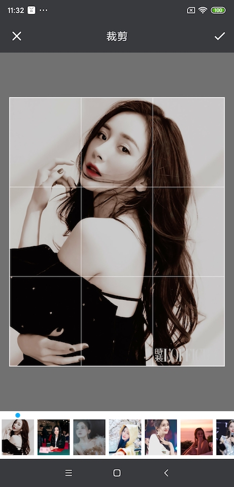
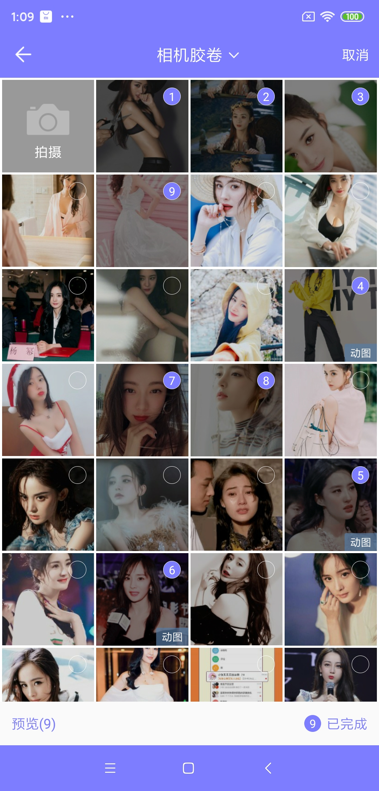
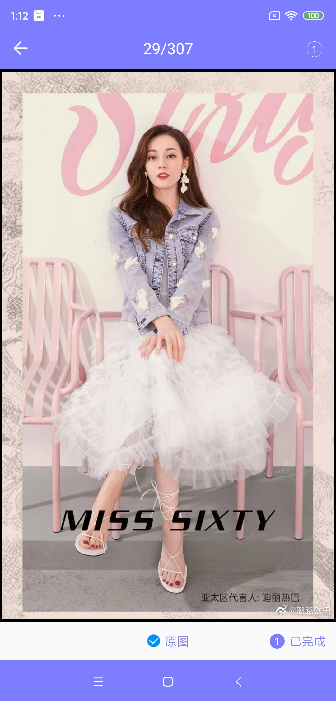
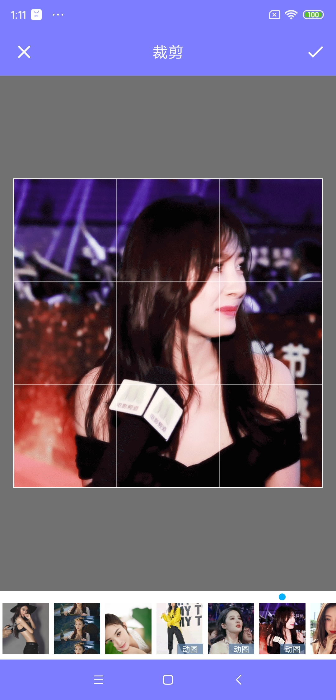
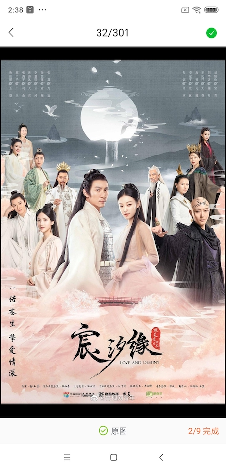
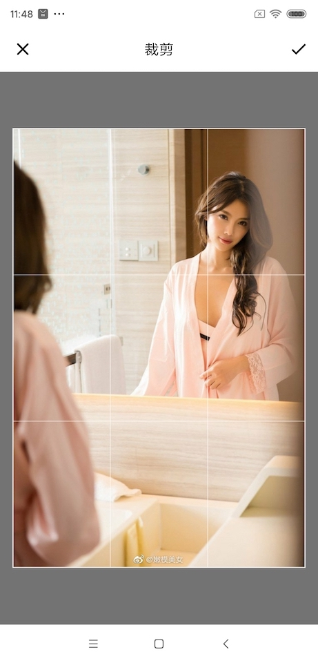
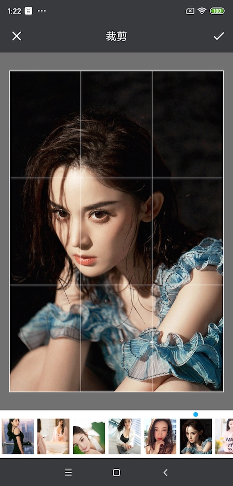
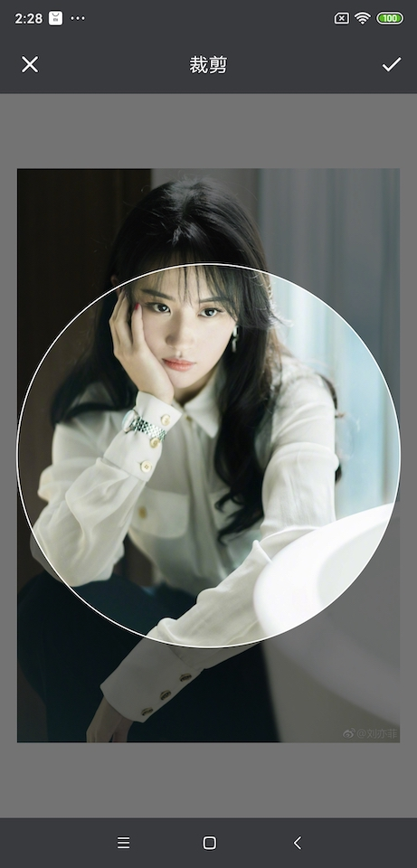

# PictureSelector 2.0
   一款针对Android平台下的图片选择器，支持从相册获取图片、视频、音频&拍照，支持裁剪(单图or多图裁剪)、压缩、主题自定义配置等功能，支持动态获取权限&适配Android 5.0+系统的开源图片选择框架。<br>
  
  <br>项目一直维护(有bug修复完一般会在周末更新)，如果有bug请描述清楚并可以提Issues，个人QQ 893855882 希望用得着的朋友点个star。 <br>
 Android开发交流 群一 619458861 (已满) <br>
 Android开发交流 群二 679824206 (已满) <br>
 Android开发交流 群三 854136996 <br>
 
  [我的博客地址](http://blog.csdn.net/luck_mw)   
  
[](https://jitpack.io/#LuckSiege/PictureSelector)
[](https://github.com/LuckSiege)
[](http://blog.csdn.net/luck_mw)
[](https://github.com/LuckSiege/PictureSelector/issues)
[](https://github.com/LuckSiege/PictureSelector)

## 目录
-[当前版本 v2.4.0](#当前版本)<br>
-[更新日志](https://github.com/LuckSiege/PictureSelector/releases/tag/v2.4.0)<br>
-[演示效果](#演示效果)<br>
-[集成方式](#集成方式)<br>
-[用前需知](#用前需知)<br>
-[功能特点](#功能特点)<br>
-[常见错误](https://github.com/LuckSiege/PictureSelector/wiki/%E5%B8%B8%E8%A7%81%E9%94%99%E8%AF%AF)<br>
-[主题配置-Xml方式](https://github.com/LuckSiege/PictureSelector/wiki/%E8%87%AA%E5%AE%9A%E4%B9%89%E4%B8%BB%E9%A2%98-Xml%E6%96%B9%E5%BC%8F)<br>
-[主题配置-Code方式](https://github.com/LuckSiege/PictureSelector/wiki/%E8%87%AA%E5%AE%9A%E4%B9%89%E5%8A%A8%E6%80%81%E4%B8%BB%E9%A2%98(%E5%8C%85%E5%90%AB%E8%A3%81%E5%89%AA%E3%80%81%E7%9B%B8%E5%86%8C%E5%90%AF%E5%8A%A8%E5%8A%A8%E7%94%BB)-Code%E6%96%B9%E5%BC%8F)<br>
-[启动相册](#启动相册)<br>
-[单独拍照](#单独拍照)<br>
-[所有功能配制](https://github.com/LuckSiege/PictureSelector/wiki/PictureSelector-%E5%8A%9F%E8%83%BD%E9%85%8D%E5%88%B6%E9%A1%B9)<br>
-[结果回调](https://github.com/LuckSiege/PictureSelector/wiki/PictureSelector-%E5%8A%9F%E8%83%BD%E9%85%8D%E5%88%B6%E9%A1%B9)<br>
-[缓存清除](#缓存清除)<br>
-[混淆配置](#混淆配置)<br>
-[LICENSE](#LICENSE)<br>
-[兼容性测试](#兼容性测试)<br>
-[打赏](#打赏)<br> 

# 用前需知 

```
v2.3.8 PictureSelector加入日志管理工具-自由选择
1.PictureSelector加入Crash日志管理工具方便错误分析，具体使用方式请查看Demo Application类中...
	Application onCreate加入两行代码
		
	/** PictureSelector日志管理配制开始 **/
	  
        // PictureSelector 绑定监听用户获取全局上下文或其他...
        PictureAppMaster.getInstance().setApp(this);
        // PictureSelector Crash日志监听
        PictureSelectorCrashUtils.init((t, e) -> {
            // Crash之后的一些操作可再此处理，没有就忽略...
        });
       
	/** PictureSelector日志管理配制结束 **/
	

v2.3.3 新增动态配制主题，建议不要与.theme(R.theme.style);方式共用 两者只选其一配制 个人建议使用动态配制为好！！！

// 动态自定义相册主题
PictureParameterStyle mPictureParameterStyle = new PictureParameterStyle(); 

// 动态自定义裁剪主题
PictureCropParameterStyle mCropParameterStyle = new PictureCropParameterStyle(); 

// 自定义相册弹起动画配制
PictureWindowAnimationStyle windowAnimationStyle = new PictureWindowAnimationStyle(); 
windowAnimationStyle.ofAllAnimation(R.anim.picture_anim_up_in, R.anim.picture_anim_down_out);

以上两者具体使用方法请参考Demo MainActivity.java实现方式

v2.3.2开始移除了glide，所以使用v2.3.2版本以后的用户一定要配制好图片加载引擎 否则列表图片加载不出来！！！
.loadImageEngine(GlideEngine.createGlideEngine())// 外部传入图片加载引擎，必传项
 具体请参考Demo MainActivity.java实现方式
```

# 功能特点

* 1.适配Android5.0+ &Android Q系统
* 2.解决部分机型裁剪闪退问题
* 3.解决图片过大oom闪退问题
* 4.动态获取系统权限，避免闪退
* 5.支持相片or视频的单选和多选
* 6.支持裁剪比例设置，如常用的 1:1、3：4、3:2、16:9 默认为图片大小
* 7.支持视频预览
* 8.支持gif图片
* 9.支持.webp格式图片 
* 10.支持一些常用场景设置：如:是否裁剪、是否预览图片、是否显示相机等
* 11.新增自定义主题设置
* 12.新增图片勾选样式设置
* 13.新增图片裁剪宽高设置
* 14.新增图片压缩处理
* 15.新增录视频最大时间设置
* 16.新增视频清晰度设置
* 17.新增QQ选择风格，带数字效果 
* 18.新增自定义 文字颜色 背景色让风格和项目更搭配
* 19.新增多图裁剪功能
* 20.新增LuBan多图压缩
* 21.新增单独拍照功能
* 22.新增压缩大小设置
* 23.新增Luban压缩档次设置
* 24.新增圆形头像裁剪
* 25.新增音频功能查询
* 26.新增可自定义启动相册动画 forResult(int requestCode, int enterAnim, int exitAnim); 
* 27.新增指定精确查询 querySpecifiedFormatSuffix(PictureMimeType.ofPNG())// 查询指定后缀格式资源
* 28.新增单选模式可设置点击选择后直接返回控制 isSingleDirectReturn(false)// 单选模式下是否直接返回
* 29.多图裁剪下可自由选择某图不裁剪不在强制一张张裁剪，但最后一张除外
* 30.新增动态配制相册主题 .setPictureStyle(mPictureParameterStyle);  请参考Demo
* 31.新增动态配制裁剪主题 .setPictureCropStyle(mCropParameterStyle); 请参考Demo
* 32.新增自定义相册启动退出动画 .setPictureWindowAnimationStyle(windowAnimationStyle); 请参考Demo
* 33.新增原图功能
* 34.新增全新相册主题风格，类似新版微信相册样式
* 35.新增繁体、韩语、德语、法语、日语语言包，可通过api .setLanguage(language);进行设置
* ....


重要的事情说三遍记得添加权限

```sh
  <uses-permission android:name="android.permission.READ_EXTERNAL_STORAGE" />
  <uses-permission android:name="android.permission.WRITE_EXTERNAL_STORAGE" />
  <uses-permission android:name="android.permission.CAMERA" />
```

## 当前版本
```sh
implementation 'com.github.LuckSiege.PictureSelector:picture_library:v2.4.0'
```

## 集成方式

方式一 compile引入

```sh
dependencies {
    implementation 'com.github.LuckSiege.PictureSelector:picture_library:v2.4.0'
}
```

项目根目录build.gradle加入

```
allprojects {
   repositories {
      jcenter()
      maven { url 'https://jitpack.io' }
   }
}
```

方式二 maven引入

step 1.
```sh
<repositories>
       <repository>
       <id>jitpack.io</id>
	<url>https://jitpack.io</url>
       </repository>
 </repositories>
```
step 2.
```sh
<dependency>
      <groupId>com.github.LuckSiege.PictureSelector</groupId>
      <artifactId>picture_library</artifactId>
      <version>v2.4.0</version> 
</dependency>
```

## 启动相册
```sh
 PictureSelector.create(this)
   .openGallery(PictureMimeType.ofImage())
   .theme(R.style.picture_default_style)
   .loadImageEngine(GlideEngine.createGlideEngine())
   .forResult(PictureConfig.CHOOSE_REQUEST);   
```

## 单独拍照 单独启动拍照或视频 根据PictureMimeType自动识别
```sh
 PictureSelector.create(this)
   .openCamera(PictureMimeType.ofImage())
   .theme(R.style.picture_default_style)
   .loadImageEngine(GlideEngine.createGlideEngine())
   .forResult(PictureConfig.CHOOSE_REQUEST);   
```

## 缓存清除
```sh
 //包括裁剪和压缩后的缓存，要在上传成功后调用，type 指的是图片or视频缓存取决于你设置的ofImage或ofVideo 注意：需要系统sd卡权限  
 PictureFileUtils.deleteCacheDirFile(MainActivity.this,type);
 // 清除所有缓存 例如：压缩、裁剪、视频、音频所生成的临时文件
 PictureFileUtils.deleteAllCacheDirFile(this);
```
 
******预览图片******       
```
// 预览图片 可自定长按保存路径
*注意 .themeStyle(R.style.theme)；里面的参数不可删，否则闪退...

PictureSelector.create(MainActivity.this)
.themeStyle(themeId)
.setPictureStyle(mPictureParameterStyle)
.isNotPreviewDownload(true)
.loadImageEngine(GlideEngine.createGlideEngine())
.openExternalPreview(position, "/custom_file", selectList);

PictureSelector.create(MainActivity.this)
.themeStyle(themeId)
.setPictureStyle(mPictureParameterStyle)
.isNotPreviewDownload(true)
.loadImageEngine(GlideEngine.createGlideEngine())
.openExternalPreview(position, selectList);

```
******预览视频****** 
```sh
PictureSelector.create(MainActivity.this).externalPictureVideo(video_path);
```

# 项目使用第三方库：

* PhotoView
* luban
* ucrop

## 混淆配置 
```sh
#PictureSelector 2.0
-keep class com.luck.picture.lib.** { *; }

-dontwarn com.yalantis.ucrop**
-keep class com.yalantis.ucrop** { *; }
-keep interface com.yalantis.ucrop** { *; }
```
## LICENSE
```sh
   Copyright 2017 Luck

   Licensed under the Apache License, Version 2.0 (the "License");
   you may not use this file except in compliance with the License.
   You may obtain a copy of the License at

       http://www.apache.org/licenses/LICENSE-2.0

   Unless required by applicable law or agreed to in writing, software
   distributed under the License is distributed on an "AS IS" BASIS,
   WITHOUT WARRANTIES OR CONDITIONS OF ANY KIND, either express or implied.
   See the License for the specific language governing permissions and
   limitations under the License.
```

## 打赏

# ~如果您觉得好，对你有帮助，可以给我一点打赏当做鼓励，蚊子再小也是肉呀(*^__^*) 嘻嘻…… 


## 兼容性测试
******腾讯优测-深度测试-通过率达到100%******


## 演示效果

| 功能项 |
|:-----------:|
|| 

| 默认样式 | 默认样式预览 | 默认样式多图裁剪 |
|:-----------:|:--------:|:---------:|
| |  | |  

| 数字风格 | 数字风格预览  | 数字风格多图裁剪 |
|:-----------:|:--------:|:---------:|
| |  | | 

| 白色主题风格 | 白色主题风格预览  | 白色主题风格单图裁剪 |
|:-----------:|:--------:|:---------:|
| |  | | 

| 仿微信风格 | 仿微信风格预览 | 仿微信风格多图裁剪 |
|:-----------:|:--------:|:---------:|
| |  | | 

| 相册目录 | 仿微信风格单选模式 | 单图圆形头像裁剪|
|:-----------:|:--------:|:--------:|
| | | | 

| 视频 | 音频 |
|:-----------:|:--------:|
| | | 

