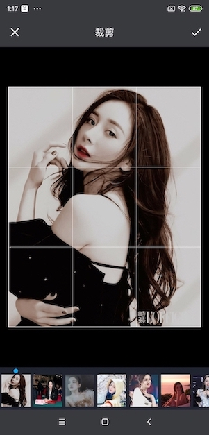
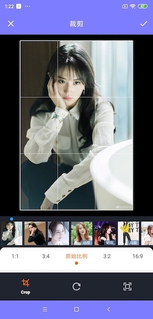
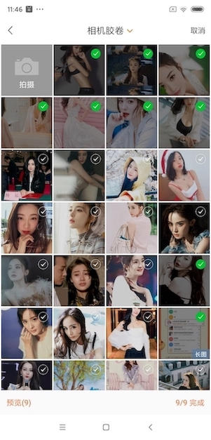
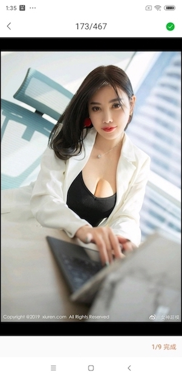
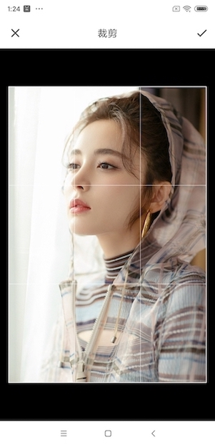

# PictureSelector 3.0 
   A PictureSelector for Android platform, which supports obtaining pictures, videos, audio & photos from photo albums, cutting (single picture or multi picture cutting), compression, theme custom configuration and other functions, and supports dynamic access & an open source picture selection framework suitable for Android 5.0 + system<br> 
   
   [简体中文🇨🇳](README_CN.md)

   [Download Demo Apk](https://github.com/LuckSiege/PictureSelector/raw/version_component/app/demo/demo_2022-08-14_082114_v3.10.6.apk)<br>

[](https://github.com/LuckSiege)
[](https://github.com/LuckSiege)
[](https://github.com/LuckSiege/PictureSelector)


## Contents
-[Last version](https://github.com/LuckSiege/PictureSelector/releases/tag/v3.10.6)<br>
-[Download](#Download)<br>
-[Usage](#Usage)<br>
-[Permission](#Permission)<br>
-[Result description](https://github.com/LuckSiege/PictureSelector/wiki/PictureSelector-3.0-LocalMedia%E8%AF%B4%E6%98%8E)<br>
-[Effect](#Effect)<br>
-[ProGuard](#ProGuard)<br>
-[Common errors](https://github.com/LuckSiege/PictureSelector/wiki/PictureSelector-3.0-%E5%B8%B8%E8%A7%81%E9%94%99%E8%AF%AF)<br>
-[Issues](https://github.com/LuckSiege/PictureSelector/wiki/%E5%A6%82%E4%BD%95%E6%8F%90Issues%3F)<br>
-[License](#License)<br>


## Download

Use Gradle

```sh
repositories {
  google()
  mavenCentral()
}

dependencies {
  // PictureSelector basic (Necessary)
  implementation 'io.github.lucksiege:pictureselector:v3.10.6'

  // image compress library (Not necessary)
  implementation 'io.github.lucksiege:compress:v3.10.6'

  // uCrop library (Not necessary)
  implementation 'io.github.lucksiege:ucrop:v3.10.6'

  // simple camerax library (Not necessary)
  implementation 'io.github.lucksiege:camerax:v3.10.6'
}
```

Or Maven:

```sh
<dependency>
  <groupId>io.github.lucksiege</groupId>
  <artifactId>pictureselector</artifactId>
  <version>v3.10.6</version>
</dependency>

<dependency>
  <groupId>io.github.lucksiege</groupId>
  <artifactId>compress</artifactId>
  <version>v3.10.6</version>
</dependency>

<dependency>
  <groupId>io.github.lucksiege</groupId>
  <artifactId>ucrop</artifactId>
  <version>v3.10.6</version>
</dependency>

<dependency>
  <groupId>io.github.lucksiege</groupId>
  <artifactId>camerax</artifactId>
  <version>v3.10.6</version>
</dependency>
```

## Permission  

Permission describe，see [documentation](https://github.com/LuckSiege/PictureSelector/wiki/PictureSelector-3.0-%E6%9D%83%E9%99%90%E4%BD%BF%E7%94%A8%E8%AF%B4%E6%98%8E)

```sh
<uses-permission android:name="android.permission.READ_EXTERNAL_STORAGE" />
<uses-permission android:name="android.permission.WRITE_EXTERNAL_STORAGE" />
<uses-permission android:name="android.permission.WRITE_MEDIA_STORAGE" />
<uses-permission android:name="android.permission.WRITE_SETTINGS" />
<uses-permission android:name="android.permission.MODIFY_AUDIO_SETTINGS" />
<uses-permission android:name="android.permission.MANAGE_EXTERNAL_STORAGE" />
<uses-permission android:name="android.permission.FOREGROUND_SERVICE" />
<uses-permission android:name="android.permission.RECORD_AUDIO" />
<uses-permission android:name="android.permission.CAMERA" />
<uses-permission android:name="android.permission.VIBRATE" />
<uses-permission android:name="android.permission.BLUETOOTH" />
```

Android 11 use camera，AndroidManifest.xm add the code：

```sh
<queries package="${applicationId}">
    <intent>
        <action android:name="android.media.action.IMAGE_CAPTURE">

        </action>
    </intent>
    <intent>
        <action android:name="android.media.action.ACTION_VIDEO_CAPTURE">

        </action>
    </intent>
</queries>
```

## ImageEngine
[GlideEngine](https://github.com/LuckSiege/PictureSelector/blob/version_component/app/src/main/java/com/luck/pictureselector/GlideEngine.java)<br> 
[PicassoEngine](https://github.com/LuckSiege/PictureSelector/blob/version_component/app/src/main/java/com/luck/pictureselector/PicassoEngine.java)<br>
[CoilEngine](https://github.com/LuckSiege/PictureSelector/blob/version_component/app/src/main/java/com/luck/pictureselector/CoilEngine.java)<br>

## Usage
For more features, see [documentation](https://github.com/LuckSiege/PictureSelector/wiki/PictureSelector-3.0-%E5%8A%9F%E8%83%BDapi%E8%AF%B4%E6%98%8E)

A simple use case is shown below:

1、Get picture 

```sh
PictureSelector.create(this)
   .openGallery(SelectMimeType.ofImage())
   .setImageEngine(GlideEngine.createGlideEngine())
   .forResult(new OnResultCallbackListener<LocalMedia>() {
      @Override
      public void onResult(ArrayList<LocalMedia> result) {

      }

      @Override
      public void onCancel() {

     }
});
```

Using system albums

```sh
PictureSelector.create(this)
     .openSystemGallery(SelectMimeType.ofImage())
     .forResult(new OnResultCallbackListener<LocalMedia>() {
        @Override
        public void onResult(ArrayList<LocalMedia> result) {

        }

        @Override
        public void onCancel() {

        }
});
```

2、Only use camera

```sh
PictureSelector.create(this)
     .openCamera(SelectMimeType.ofImage())
     .forResult(new OnResultCallbackListener<LocalMedia>() {
        @Override
        public void onResult(ArrayList<LocalMedia> result) {

        }

        @Override
        public void onCancel() {

        }
});
```

To take photos separately in the Navigation Fragment scene, please use the following methods:

```sh
PictureSelector.create(this)
     .openCamera(SelectMimeType.ofImage())
     .forResultActivity(new OnResultCallbackListener<LocalMedia>() {
        @Override
        public void onResult(ArrayList<LocalMedia> result) {

        }

        @Override
        public void onCancel() {

        }
});
```

3、You can also use the following example：

(1)、Inject into any view fragment

```sh

PictureSelector.create(this)
   .openGallery(SelectMimeType.ofAll())
   .setImageEngine(GlideEngine.createGlideEngine())
   .buildLaunch(R.id.fragment_container, new OnResultCallbackListener<LocalMedia>() {
      @Override
      public void onResult(ArrayList<LocalMedia> result) {
      
      }

      @Override
      public void onCancel() {
      
      }
});
			
```

(2)、Custom Inject into any view fragment

```sh

PictureSelectorFragment selectorFragment = PictureSelector.create(this)
     .openGallery(SelectMimeType.ofAll())
     .setImageEngine(GlideEngine.createGlideEngine())
     .build();
     
getSupportFragmentManager().beginTransaction()
     .add(R.id.fragment_container, selectorFragment, selectorFragment.getFragmentTag())
     .addToBackStack(selectorFragment.getFragmentTag())
     .commitAllowingStateLoss();
			
```

4、Only query data source

(1)、get album data

```sh

PictureSelector.create(this)
    .dataSource(SelectMimeType.ofAll())
    .obtainAlbumData(new OnQueryDataSourceListener<LocalMediaFolder>() {
        @Override
        public void onComplete(List<LocalMediaFolder> result) {

        }
   );

```

(2)、get media data

```sh

PictureSelector.create(this)
    .dataSource(SelectMimeType.ofAll())
    .obtainMediaData(new OnQueryDataSourceListener<LocalMedia>() {
        @Override
        public void onComplete(List<LocalMedia> result) {

        }
   );

```

(3)、IBridgeMediaLoader get data 

```sh

IBridgeMediaLoader loader = PictureSelector.create(this)
    .dataSource(SelectMimeType.ofImage()).buildMediaLoader();
    loader.loadAllAlbum(new OnQueryAllAlbumListener<LocalMediaFolder>() {
        @Override
        public void onComplete(List<LocalMediaFolder> result) {

        }
  });

```

5、Preview image、video、audio

If you preview the online video AndroidManifest XML add the following code

```sh
android:usesCleartextTraffic="true"
```

```sh

PictureSelector.create(this)
    .openPreview()
    .setImageEngine(GlideEngine.createGlideEngine())
    .setExternalPreviewEventListener(new OnExternalPreviewEventListener() {
       @Override
       public void onPreviewDelete(int position) {

       }

        @Override
       public boolean onLongPressDownload(LocalMedia media) {
           return false;
       }
    }).startActivityPreview(position, true, "data");

```


Set theme，see [documentation](https://github.com/LuckSiege/PictureSelector/wiki/PictureSelector-3.0-%E4%B8%BB%E9%A2%98api%E8%AF%B4%E6%98%8E)

```sh
.setSelectorUIStyle();
```
Or Overload layout，see [documentation](https://github.com/LuckSiege/PictureSelector/wiki/PictureSelector-3.0-%E5%A6%82%E4%BD%95%E9%87%8D%E8%BD%BD%E5%B8%83%E5%B1%80%EF%BC%9F)

```sh
.setInjectLayoutResourceListener(new OnInjectLayoutResourceListener() {
   @Override
   public int getLayoutResourceId(Context context, int resourceSource) {
	return 0;
}
```

The advanced use cases are as follow：

1、Use the custom camera,See [documentation](https://github.com/LuckSiege/PictureSelector/wiki/PictureSelector-3.0-%E5%A6%82%E4%BD%95%E8%87%AA%E5%AE%9A%E4%B9%89%E7%9B%B8%E6%9C%BA%EF%BC%9F)

```sh
.setCameraInterceptListener(new OnCameraInterceptListener() {
    @Override
    public void openCamera(Fragment fragment, int cameraMode, int requestCode){

    }
});
```

2、Use the image compress,See [documentation](https://github.com/LuckSiege/PictureSelector/wiki/PictureSelector-3.0-%E5%A6%82%E4%BD%95%E5%8E%8B%E7%BC%A9%EF%BC%9F)

```sh
.setCompressEngine(new CompressFileEngine() {
   @Override
   public void onStartCompress(Context context, ArrayList<Uri> source, OnKeyValueResultCallbackListener call){

   }
});
```

3、Use the image uCrop,See [documentation](https://github.com/LuckSiege/PictureSelector/wiki/PictureSelector-3.0-%E5%A6%82%E4%BD%95%E8%A3%81%E5%89%AA%EF%BC%9F)

```sh

.setCropEngine(new CropFileEngine() {
   @Override
   public void onStartCrop(Fragment fragment, Uri srcUri, Uri destinationUri, ArrayList<String> dataSource, int requestCode) {

   }
});
```

4、Use the image edit,See [documentation](https://github.com/LuckSiege/PictureSelector/wiki/PictureSelector-3.0-%E5%A6%82%E4%BD%95%E7%BC%96%E8%BE%91%E5%9B%BE%E7%89%87%EF%BC%9F)

```sh
.setEditMediaInterceptListener(new OnMediaEditInterceptListener() {
    @Override
    public void onStartMediaEdit(Fragment fragment, LocalMedia currentLocalMedia, int requestCode) {

    }
});

```

5、Use the custom load data,See [documentation](https://github.com/LuckSiege/PictureSelector/wiki/PictureSelector-3.0-%E5%A6%82%E4%BD%95%E5%8A%A0%E8%BD%BD%E8%87%AA%E5%AE%9A%E4%B9%89%E6%95%B0%E6%8D%AE%E6%BA%90%EF%BC%9F)

```sh
.setExtendLoaderEngine(new ExtendLoaderEngine() {
    @Override
    public void loadAllAlbumData(Context context, OnQueryAllAlbumListener<LocalMediaFolder> query) {
                                    
    }

    @Override
    public void loadOnlyInAppDirAllMediaData(Context context, OnQueryAlbumListener<LocalMediaFolder> query) {

    }

    @Override
    public void loadFirstPageMediaData(Context context, long bucketId, int page, int pageSize, OnQueryDataResultListener<LocalMedia> query) {

    }

    @Override
    public void loadMoreMediaData(Context context, long bucketId, int page, int limit, int pageSize, OnQueryDataResultListener<LocalMedia> query) {

    }
 });

```

6、Use the custom apply Permissions,See [documentation](https://github.com/LuckSiege/PictureSelector/wiki/PictureSelector-3.0-%E5%A6%82%E4%BD%95%E8%87%AA%E5%AE%9A%E4%B9%89%E6%9D%83%E9%99%90%E7%94%B3%E8%AF%B7-%EF%BC%9F)

```sh
.setPermissionsInterceptListener(new OnPermissionsInterceptListener() {
      @Override
      public void requestPermission(Fragment fragment, String[] permissionArray, OnRequestPermissionListener call) {

      }

      @Override
      public boolean hasPermissions(Fragment fragment, String[] permissionArray) {
      return false;
  }
});

```

7、Android 10 and above, Sandbox mechanism, file processing，Permissions,See [documentation](https://github.com/LuckSiege/PictureSelector/wiki/PictureSelector-3.0-%E5%A6%82%E4%BD%95%E8%AE%BF%E9%97%AE%E6%B2%99%E7%9B%92%E5%A4%96%E8%B5%84%E6%BA%90%EF%BC%9F)

```sh
.setSandboxFileEngine(new UriToFileTransformEngine() {
    @Override
    public void onUriToFileAsyncTransform(Context context, String srcPath, String mineType, OnKeyValueResultCallbackListener call) {
                                        
    }
});
```

## ProGuard
```sh
-keep class com.luck.picture.lib.** { *; }

// use Camerax
-keep class com.luck.lib.camerax.** { *; }

// use uCrop
-dontwarn com.yalantis.ucrop**
-keep class com.yalantis.ucrop** { *; }
-keep interface com.yalantis.ucrop** { *; }
```
## License
```sh
Copyright 2016 Luck

Licensed under the Apache License, Version 2.0 (the "License");
you may not use this file except in compliance with the License.
You may obtain a copy of the License at

http://www.apache.org/licenses/LICENSE-2.0

Unless required by applicable law or agreed to in writing, software
distributed under the License is distributed on an "AS IS" BASIS,
WITHOUT WARRANTIES OR CONDITIONS OF ANY KIND, either express or implied.
See the License for the specific language governing permissions and
limitations under the License.
```


## Effect

| Function list |
|:-----------:|
||

| Default Style | Preview | Multiple Crop |
|:-----------:|:--------:|:---------:|
| |  | |

| Digital Style | Preview | Multiple Crop |
|:-----------:|:--------:|:---------:|
| |  | |

| White Style | Preview | Single Crop |
|:-----------:|:--------:|:---------:|
| |  | |

| New Style | Preview | Multiple Crop |
|:-----------:|:--------:|:---------:|
| |  | |

| Photo Album Directory | Single Mode | Circular Crop|
|:-----------:|:--------:|:--------:|
| | | |

| White Style | Video | Audio |
|:-----------:|:-----------:|:--------:|
| | | |

