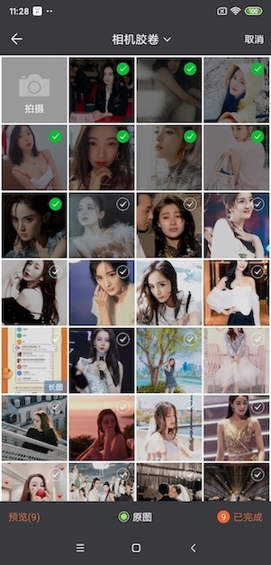
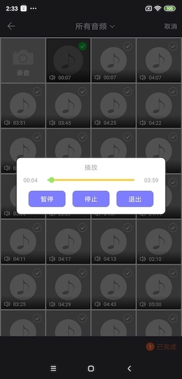

# PictureSelector 2.0
   一款针对Android平台下的图片选择器，支持从相册获取图片、视频、音频&拍照，支持裁剪(单图or多图裁剪)、压缩、主题自定义配置等功能，支持动态获取权限&适配Android 5.0+系统的开源图片选择框架。<br>
  
  <br>项目一直维护(有bug修复完一般会在周末更新)，如果有bug请描述清楚并可以提Issues，个人QQ 893855882 希望用得着的朋友点个star。 <br>
 Android开发交流 群一 619458861 (已满) <br>
 Android开发交流 群二 679824206 (已满) <br>
 Android开发交流 群三 854136996 <br>
 
   [我的博客地址](http://blog.csdn.net/luck_mw)   
  
   [Demo体验](https://github.com/LuckSiege/PictureSelector/raw/master/app/demo/app_2020_01_16_1015_2.4.5.apk)<br>
  
[](https://jitpack.io/#LuckSiege/PictureSelector)
[](https://github.com/LuckSiege)
[](http://blog.csdn.net/luck_mw)
[](https://github.com/LuckSiege/PictureSelector/issues)
[](https://github.com/LuckSiege/PictureSelector)

## 目录
-[用前需知](https://github.com/LuckSiege/PictureSelector/wiki/%E7%94%A8%E5%89%8D%E9%9C%80%E7%9F%A5)<br>
-[如何提Issues?](https://github.com/LuckSiege/PictureSelector/wiki/%E5%A6%82%E4%BD%95%E6%8F%90Issues%3F)<br>
-[功能特点](https://github.com/LuckSiege/PictureSelector/wiki/%E5%8A%9F%E8%83%BD%E7%89%B9%E7%82%B9)<br>
-[最新版本 v2.4.5](#最新版本)<br>
-[更新日志](https://github.com/LuckSiege/PictureSelector/releases/tag/v2.4.5)<br>
-[主题配置-Xml方式](https://github.com/LuckSiege/PictureSelector/wiki/%E8%87%AA%E5%AE%9A%E4%B9%89%E4%B8%BB%E9%A2%98-Xml%E6%96%B9%E5%BC%8F)<br>
-[主题配置-Code方式](https://github.com/LuckSiege/PictureSelector/wiki/%E8%87%AA%E5%AE%9A%E4%B9%89%E5%8A%A8%E6%80%81%E4%B8%BB%E9%A2%98(%E5%8C%85%E5%90%AB%E8%A3%81%E5%89%AA%E3%80%81%E7%9B%B8%E5%86%8C%E5%90%AF%E5%8A%A8%E5%8A%A8%E7%94%BB)-Code%E6%96%B9%E5%BC%8F)<br>
-[演示效果](#演示效果)<br>
-[集成方式](https://github.com/LuckSiege/PictureSelector/wiki/%E9%9B%86%E6%88%90%E6%96%B9%E5%BC%8F)<br>
-[启动相册](#启动相册)<br>
-[单独拍照](#单独拍照)<br>
-[结果回调](https://github.com/LuckSiege/PictureSelector/wiki/%E7%BB%93%E6%9E%9C%E5%9B%9E%E8%B0%83)<br>
-[常见错误](https://github.com/LuckSiege/PictureSelector/wiki/%E5%B8%B8%E8%A7%81%E9%94%99%E8%AF%AF)<br>
-[缓存清除](#缓存清除)<br>
-[混淆配置](#混淆配置)<br>
-[LICENSE](#LICENSE)<br>
-[兼容性测试](#兼容性测试)<br>
-[打赏](#打赏)<br> 


## 最新版本
```sh
implementation 'com.github.LuckSiege.PictureSelector:picture_library:v2.4.5'
```

## 启动相册
快捷调用，更多功能 [请查看](https://github.com/LuckSiege/PictureSelector/wiki/PictureSelector-%E5%8A%9F%E8%83%BD%E9%85%8D%E5%88%B6%E9%A1%B9)
```sh
 PictureSelector.create(this)
   .openGallery(PictureMimeType.ofImage())
   .loadImageEngine(GlideEngine.createGlideEngine()) // 请参考Demo GlideEngine.java
   .forResult(PictureConfig.CHOOSE_REQUEST);   
```

## 单独拍照
快捷调用，单独启动拍照或视频 根据PictureMimeType自动识别 更多功能 [请查看](https://github.com/LuckSiege/PictureSelector/wiki/PictureSelector-%E5%8A%9F%E8%83%BD%E9%85%8D%E5%88%B6%E9%A1%B9)
```sh
 PictureSelector.create(this)
   .openCamera(PictureMimeType.ofImage())
   .loadImageEngine(GlideEngine.createGlideEngine()) // 请参考Demo GlideEngine.java
   .forResult(PictureConfig.REQUEST_CAMERA);   
```

## 缓存清除
```sh
 //包括裁剪和压缩后的缓存，要在上传成功后调用，type 指的是图片or视频缓存取决于你设置的ofImage或ofVideo 注意：需要系统sd卡权限  
 PictureFileUtils.deleteCacheDirFile(this,type);
 // 清除所有缓存 例如：压缩、裁剪、视频、音频所生成的临时文件
 PictureFileUtils.deleteAllCacheDirFile(this);
```
 
## 预览图片 
```
// 预览图片 可自定长按保存路径
*注意 .themeStyle(R.style.theme)；里面的参数不可删，否则闪退...

PictureSelector.create(this)
 .themeStyle(R.style.picture_default_style)
 .isNotPreviewDownload(true)
 .loadImageEngine(GlideEngine.createGlideEngine()) // 请参考Demo GlideEngine.java
 .openExternalPreview(position, selectList);

```
## 预览视频
```sh
PictureSelector.create(this).externalPictureVideo(video_path);
```

## 项目使用第三方库：

* PhotoView
* luban
* ucrop

## 混淆配置 
```sh
#PictureSelector 2.0
-keep class com.luck.picture.lib.** { *; }

-dontwarn com.yalantis.ucrop**
-keep class com.yalantis.ucrop** { *; }
-keep interface com.yalantis.ucrop** { *; }
```
## LICENSE
```sh
   Copyright 2017 Luck

   Licensed under the Apache License, Version 2.0 (the "License");
   you may not use this file except in compliance with the License.
   You may obtain a copy of the License at

       http://www.apache.org/licenses/LICENSE-2.0

   Unless required by applicable law or agreed to in writing, software
   distributed under the License is distributed on an "AS IS" BASIS,
   WITHOUT WARRANTIES OR CONDITIONS OF ANY KIND, either express or implied.
   See the License for the specific language governing permissions and
   limitations under the License.
```

## 打赏

# ~如果您觉得好，对你有帮助，可以给我一点打赏当做鼓励，蚊子再小也是肉呀(*^__^*) 嘻嘻…… 


## 兼容性测试
******腾讯优测-深度测试-通过率达到100%******


## 演示效果

| 功能项&单一模式 | 功能项&混选模式 |
|:-----------:|:-----------:|
||| 

| 默认样式 | 默认样式预览 | 默认样式多图裁剪 |
|:-----------:|:--------:|:---------:|
| |  | |  

| 数字风格 | 数字风格预览  | 数字风格多图裁剪 |
|:-----------:|:--------:|:---------:|
| |  | | 

| 白色主题风格 | 白色主题风格预览  | 白色主题风格单图裁剪 |
|:-----------:|:--------:|:---------:|
| |  | | 

| 仿微信风格 | 仿微信风格预览 | 仿微信风格多图裁剪 |
|:-----------:|:--------:|:---------:|
| |  | | 

| 相册目录 | 仿微信风格单选模式 | 单图圆形头像裁剪|
|:-----------:|:--------:|:--------:|
| | | | 

| 白色主题风格 | 视频 | 音频 |
|:-----------:|:-----------:|:--------:|
| | | | 

