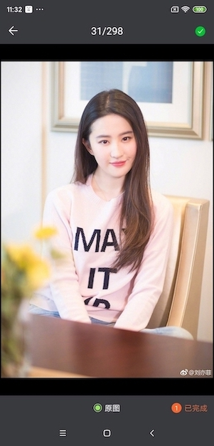
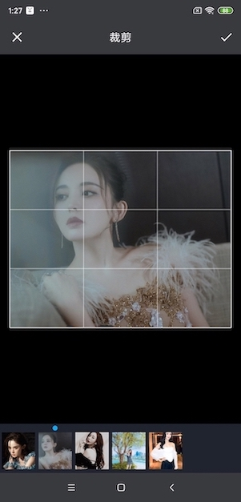
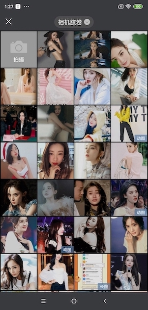
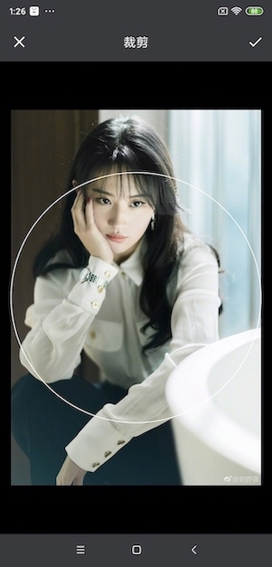
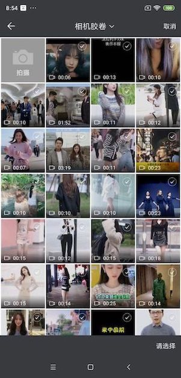

# PictureSelector 2.0
   A Picture Selector for Android platform, support from the album to obtain pictures, video, audio & photo, support crop (single picture or multi-picture crop), compression, theme custom configuration and other functions, support dynamic access & adapt to Android 5.0+ system of open source picture selection framework。<br>

[中文版🇨🇳](README_CN.md) 

[Download APK](https://github.com/LuckSiege/PictureSelector/raw/master/app/demo/app_2021-04-10_070127_2.6.1.apk)<br>

[](https://jitpack.io/#LuckSiege/PictureSelector)
[](https://github.com/LuckSiege)
[](http://blog.csdn.net/luck_mw)
[](https://github.com/LuckSiege/PictureSelector/issues)
[](https://github.com/LuckSiege/PictureSelector)

## Directory
-[Latest Version v2.6.1](#Version)<br>
-[Update Log](https://github.com/LuckSiege/PictureSelector/releases/tag/v2.6.1)<br>
-[Style Configuration-Xml](https://github.com/LuckSiege/PictureSelector/wiki/%E8%87%AA%E5%AE%9A%E4%B9%89%E4%B8%BB%E9%A2%98-Xml%E6%96%B9%E5%BC%8F)<br>
-[Style Configuration-Code](https://github.com/LuckSiege/PictureSelector/wiki/%E8%87%AA%E5%AE%9A%E4%B9%89%E5%8A%A8%E6%80%81%E4%B8%BB%E9%A2%98(%E5%8C%85%E5%90%AB%E8%A3%81%E5%89%AA%E3%80%81%E7%9B%B8%E5%86%8C%E5%90%AF%E5%8A%A8%E5%8A%A8%E7%94%BB)-Code%E6%96%B9%E5%BC%8F)<br>
-[Demo Effect](#Effect)<br>
-[Method Of Use](https://github.com/LuckSiege/PictureSelector/wiki/%E9%9B%86%E6%88%90%E6%96%B9%E5%BC%8F)<br>
-[Api Explain](https://github.com/LuckSiege/PictureSelector/wiki/PictureSelector-Api)<br>
-[Open Photo Album](#Photo)<br>
-[Open Camera](#Camera)<br>
-[Custom Camera](#CustomCamera)<br>
-[Results Callback](https://github.com/LuckSiege/PictureSelector/wiki/Result-Callback)<br>
-[Cache Clear](#CacheClear)<br>
-[Confusion](#Confusion)<br>
-[License](#License)<br>

## Version
step 1
```sh
implementation 'com.github.LuckSiege.PictureSelector:picture_library:v2.6.1'
```

step 2
```sh
allprojects {
   repositories {
      jcenter()
      maven { url 'https://jitpack.io' }
   }
}
```

## Photo
Quick call, more functions [More](https://github.com/LuckSiege/PictureSelector/wiki/PictureSelector-Api)

1、onActivityResult
```sh 
 PictureSelector.create(this)
   .openGallery(PictureMimeType.ofImage())
   .loadImageEngine(GlideEngine.createGlideEngine()) // Please refer to the Demo GlideEngine.java
   .forResult(PictureConfig.CHOOSE_REQUEST);
   
    @Override
    protected void onActivityResult(int requestCode, int resultCode, Intent data) {
        super.onActivityResult(requestCode, resultCode, data);
        if (resultCode == RESULT_OK) {
            switch (requestCode) {
                case PictureConfig.CHOOSE_REQUEST:
                    // onResult Callback
                    List<LocalMedia> selectList = PictureSelector.obtainMultipleResult(data);
                    break;
                default:
                    break;
            }            
        }
```

2、Callback
```sh
 PictureSelector.create(this)
   .openGallery(PictureMimeType.ofAll())
   .loadImageEngine(GlideEngine.createGlideEngine())
   .forResult(new OnResultCallbackListener<LocalMedia>() {
       @Override
       public void onResult(List<LocalMedia> result) {
            // onResult Callback
       }

       @Override
       public void onCancel() {
            // onCancel Callback
       }
     });  
```

## Camera
Quick Use, separately start the photo or video according to PictureMimeType automatic recognition [More](https://github.com/LuckSiege/PictureSelector/wiki/PictureSelector-Api)

onActivityResult
```sh
 PictureSelector.create(this)
   .openCamera(PictureMimeType.ofImage())
   .loadImageEngine(GlideEngine.createGlideEngine()) // Please refer to the Demo GlideEngine.java
   .forResult(PictureConfig.REQUEST_CAMERA);  
   
    @Override
    protected void onActivityResult(int requestCode, int resultCode, Intent data) {
        super.onActivityResult(requestCode, resultCode, data);
        if (resultCode == RESULT_OK) {
            switch (requestCode) {
                case PictureConfig.REQUEST_CAMERA:
                    // onResult Callback
                    List<LocalMedia> selectList = PictureSelector.obtainMultipleResult(data);
                    break;
                default:
                    break;
            }            
        }
```

Callback
```sh
PictureSelector.create(this)
   .openCamera(PictureMimeType.ofImage())
   .loadImageEngine(GlideEngine.createGlideEngine())
   .forResult(new OnResultCallbackListener<LocalMedia>() {
       @Override
       public void onResult(List<LocalMedia> result) {
            // onResult Callback
       }

       @Override
       public void onCancel() {
            // onCancel Callback
       }
     });
```

## CustomCamera
If you need to use a custom camera you need to set up
```
.isUseCustomCamera(true);
``` 
Application implementing interface
```sh
 public class App extends Application implements CameraXConfig.Provider {
    private static final String TAG = App.class.getSimpleName();

    @Override
    public void onCreate() {
        super.onCreate();
    }

    @NonNull
    @Override
    public CameraXConfig getCameraXConfig() {
        return Camera2Config.defaultConfig();
    }
 }
```

## CacheClear
```sh
 // Include clipped and compressed cache, to be called upon successful upload, type refers to the image or video cache depending on which ofImage or ofVideo you set up note: system sd card permissions are required
 PictureFileUtils.deleteCacheDirFile(this,type);
 // Clear all temporary files generated by caching such as compression, clipping, video, and audio
 PictureFileUtils.deleteAllCacheDirFile(this);
```
 
## Preview Image
```
// Preview picture can be customized length press save path
*Prompt .themeStyle(R.style.theme)；Inside the parameters can not be deleted, otherwise crash...

PictureSelector.create(this)
 .themeStyle(R.style.picture_default_style)
 .isNotPreviewDownload(true)
 .loadImageEngine(GlideEngine.createGlideEngine())
 .openExternalPreview(position, selectList);

```
## Preview Video
```sh
PictureSelector.create(this).externalPictureVideo(video_path);
```

## Project use libraries

* PhotoView
* luban
* ucrop

## Confusion
```sh
#PictureSelector 2.0
-keep class com.luck.picture.lib.** { *; }

#Ucrop
-dontwarn com.yalantis.ucrop**
-keep class com.yalantis.ucrop** { *; }
-keep interface com.yalantis.ucrop** { *; }

#Okio
-dontwarn org.codehaus.mojo.animal_sniffer.*
```
## License
```sh
   Copyright 2017 Luck

   Licensed under the Apache License, Version 2.0 (the "License");
   you may not use this file except in compliance with the License.
   You may obtain a copy of the License at

       http://www.apache.org/licenses/LICENSE-2.0

   Unless required by applicable law or agreed to in writing, software
   distributed under the License is distributed on an "AS IS" BASIS,
   WITHOUT WARRANTIES OR CONDITIONS OF ANY KIND, either express or implied.
   See the License for the specific language governing permissions and
   limitations under the License.
```

## Contact
Android Group 1 [619458861]() (biggest) <br>
Android Group 2 [679824206]() (biggest) <br>
Android Group 3 [854136996]() (biggest) <br>
QQ [893855882]() <br>


## Effect

| Single Mode | Mixed Mode |
|:-----------:|:-----------:|
||| 

| Default Style | Preview | Multiple Crop |
|:-----------:|:--------:|:---------:|
| |  | |  

| Digital Style | Preview | Multiple Crop |
|:-----------:|:--------:|:---------:|
| |  | | 

| White Style | Preview | Single Crop |
|:-----------:|:--------:|:---------:|
| |  | | 

| New Style | Preview | Multiple Crop |
|:-----------:|:--------:|:---------:|
| |  | | 

| Photo Album Directory | Single Mode | Circular Crop|
|:-----------:|:--------:|:--------:|
| | | | 

| White Style | Video | Audio |
|:-----------:|:-----------:|:--------:|
| | | | 


