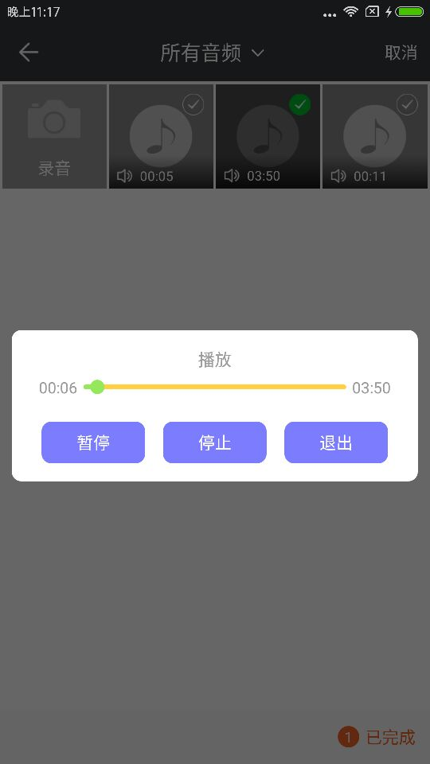

# PictureSelector 2.0
   一款针对Android平台下的图片选择器，支持从相册获取图片、视频、音频&拍照，支持裁剪(单图or多图裁剪)、压缩、主题自定义配置等功能，支持动态获取权限&适配Android 5.0+系统的开源图片选择框架。<br>
  
  <br>项目一直维护(有bug修复完一般会在周末更新)，如果有bug请描述清楚并可以提Issues，个人QQ 893855882 希望用得着的朋友点个star。 <br>
 Android开发交流 群一 619458861 (已满) <br>
 Android开发交流 群二 679824206 (已满) <br>
 Android开发交流 群三 854136996 <br>
 
  [我的博客地址](http://blog.csdn.net/luck_mw)   
  
[](https://jitpack.io/#LuckSiege/PictureSelector)
[](https://github.com/LuckSiege)
[](http://blog.csdn.net/luck_mw)
[](https://github.com/LuckSiege/PictureSelector/issues)
[](https://github.com/LuckSiege/PictureSelector)

## 目录
-[当前版本 v2.4.0](#当前版本)<br>
-[更新日志](https://github.com/LuckSiege/PictureSelector/releases/tag/v2.4.0)<br>
-[演示效果](#演示效果)<br>
-[集成方式](#集成方式)<br>
-[用前需知](#用前需知)<br>
-[功能特点](#功能特点)<br>
-[常见错误](#常见错误)<br>
-[功能配置](#功能配置)<br>
-[缓存清除](#缓存清除)<br>
-[主题配置-Xml方式](#主题配置)<br>
-[主题配置-Code方式](#动态主题配置)<br>
-[常用功能](#常用功能)<br>
-[结果回调](#结果回调)<br>
-[混淆配置](#混淆配置)<br>
-[LICENSE](#LICENSE)<br>
-[兼容性测试](#兼容性测试)<br>
-[打赏](#打赏)<br> 

# 用前需知 

```
v2.3.8 PictureSelector加入日志管理工具-自由选择
1.PictureSelector加入Crash日志管理工具方便错误分析，具体使用方式请查看Demo Application类中...
	Application onCreate加入两行代码
		
	/** PictureSelector日志管理配制开始 **/
	  
        // PictureSelector 绑定监听用户获取全局上下文或其他...
        PictureAppMaster.getInstance().setApp(this);
        // PictureSelector Crash日志监听
        PictureSelectorCrashUtils.init((t, e) -> {
            // Crash之后的一些操作可再此处理，没有就忽略...
        });
       
	/** PictureSelector日志管理配制结束 **/
	

v2.3.3 新增动态配制主题，建议不要与.theme(R.theme.style);方式共用 两者只选其一配制 个人建议使用动态配制为好！！！

// 动态自定义相册主题
PictureParameterStyle mPictureParameterStyle = new PictureParameterStyle(); 

// 动态自定义裁剪主题
PictureCropParameterStyle mCropParameterStyle = new PictureCropParameterStyle(); 

// 自定义相册弹起动画配制
PictureWindowAnimationStyle windowAnimationStyle = new PictureWindowAnimationStyle(); 
windowAnimationStyle.ofAllAnimation(R.anim.picture_anim_up_in, R.anim.picture_anim_down_out);

以上两者具体使用方法请参考Demo MainActivity.java实现方式

v2.3.2开始移除了glide，所以使用v2.3.2版本以后的用户一定要配制好图片加载引擎 否则列表图片加载不出来！！！
.loadImageEngine(GlideEngine.createGlideEngine())// 外部传入图片加载引擎，必传项
 具体请参考Demo MainActivity.java实现方式
```

# 功能特点

* 1.适配Android5.0+ &Android Q系统
* 2.解决部分机型裁剪闪退问题
* 3.解决图片过大oom闪退问题
* 4.动态获取系统权限，避免闪退
* 5.支持相片or视频的单选和多选
* 6.支持裁剪比例设置，如常用的 1:1、3：4、3:2、16:9 默认为图片大小
* 7.支持视频预览
* 8.支持gif图片
* 9.支持.webp格式图片 
* 10.支持一些常用场景设置：如:是否裁剪、是否预览图片、是否显示相机等
* 11.新增自定义主题设置
* 12.新增图片勾选样式设置
* 13.新增图片裁剪宽高设置
* 14.新增图片压缩处理
* 15.新增录视频最大时间设置
* 16.新增视频清晰度设置
* 17.新增QQ选择风格，带数字效果 
* 18.新增自定义 文字颜色 背景色让风格和项目更搭配
* 19.新增多图裁剪功能
* 20.新增LuBan多图压缩
* 21.新增单独拍照功能
* 22.新增压缩大小设置
* 23.新增Luban压缩档次设置
* 24.新增圆形头像裁剪
* 25.新增音频功能查询
* 26.新增可自定义启动相册动画 forResult(int requestCode, int enterAnim, int exitAnim); 
* 27.新增指定精确查询 querySpecifiedFormatSuffix(PictureMimeType.ofPNG())// 查询指定后缀格式资源
* 28.新增单选模式可设置点击选择后直接返回控制 isSingleDirectReturn(false)// 单选模式下是否直接返回
* 29.多图裁剪下可自由选择某图不裁剪不在强制一张张裁剪，但最后一张除外
* 30.新增动态配制相册主题 .setPictureStyle(mPictureParameterStyle);  请参考Demo
* 31.新增动态配制裁剪主题 .setPictureCropStyle(mCropParameterStyle); 请参考Demo
* 32.新增自定义相册启动退出动画 .setPictureWindowAnimationStyle(windowAnimationStyle); 请参考Demo
* 33.新增原图功能
* 34.新增全新相册主题风格，类似新版微信相册样式
* 35.新增繁体、韩语、德语、法语、日语语言包，可通过api .setLanguage(language);进行设置
* ....


重要的事情说三遍记得添加权限

```sh
  <uses-permission android:name="android.permission.READ_EXTERNAL_STORAGE" />
  <uses-permission android:name="android.permission.WRITE_EXTERNAL_STORAGE" />
  <uses-permission android:name="android.permission.CAMERA" />
```

## 当前版本
```sh
implementation 'com.github.LuckSiege.PictureSelector:picture_library:v2.4.0'
```

## 集成方式

方式一 compile引入

```sh
dependencies {
    implementation 'com.github.LuckSiege.PictureSelector:picture_library:v2.4.0'
}
```

项目根目录build.gradle加入

```
allprojects {
   repositories {
      jcenter()
      maven { url 'https://jitpack.io' }
   }
}
```

方式二 maven引入

step 1.
```sh
<repositories>
       <repository>
       <id>jitpack.io</id>
	<url>https://jitpack.io</url>
       </repository>
 </repositories>
```
step 2.
```sh
<dependency>
      <groupId>com.github.LuckSiege.PictureSelector</groupId>
      <artifactId>picture_library</artifactId>
      <version>v2.4.0</version> 
</dependency>
```

## 常见错误
```sh
 重要：PictureSelector.create()；调用此方法时，在activity中传activity.this，在fragment中请传fragment.this,
 影响回调到哪个地方的onActivityResult()。
 
 问题一：
 rxjava冲突：在app build.gradle下添加
 packagingOptions {
   exclude 'META-INF/rxjava.properties'
 }  
 
 问题二：
 java.lang.NullPointerException: 
 Attempt to invoke virtual method 'android.content.res.XmlResourceParser 
 android.content.pm.ProviderInfo.loadXmlMetaData(android.content.pm.PackageManager, java.lang.String)'
 on a null object reference
 
 * 注意 从v2.1.3版本中，将不需要配制以下内容
 
 application下添加如下节点:
 
 <provider
      android:name="android.support.v4.content.FileProvider"
      android:authorities="${applicationId}.provider"
      android:exported="false"
      android:grantUriPermissions="true">
       <meta-data
         android:name="android.support.FILE_PROVIDER_PATHS"
         android:resource="@xml/file_paths" />
</provider>

注意：如已添加其他sdk或项目中已使用过provider节点，
[请参考我的博客](http://blog.csdn.net/luck_mw/article/details/54970105)的解决方案

问题三：
经测试在小米部分低端机中，Fragment调用PictureSelector 2.0 拍照有时内存不足会暂时回收activity,
导致其fragment会重新创建 建议在fragment所依赖的activity加上如下代码:
if (savedInstanceState == null) {
      // 添加显示第一个fragment
      	fragment = new PhotoFragment();
      		getSupportFragmentManager().beginTransaction().add(R.id.tab_content, fragment,
                    PictureConfig.FC_TAG).show(fragment)
                    .commit();
     } else { 
      	fragment = (PhotoFragment) getSupportFragmentManager()
          .findFragmentByTag(PictureConfig.FC_TAG);
}
这里就是如果是被回收时，则不重新创建 通过tag取出fragment的实例。

问题四：  使用v2.3.2版本以后的用户忽略...
glide冲突
由于PictureSelector 2.0引入的是最新的glide 4.5.0,所以将项目中老版本的glide删除,并且将报错代码换成如下写法：
RequestOptions options = new RequestOptions();
options.placeholder(R.drawable.image);
Glide.with(context).load(url).apply(options).into(imageView);

问题五：
拍照出现损坏问题
如果出现拍照返回后图片加载不出来出现已损坏现象，建议提前获取一下存储权限，也就是通过RxPermissions.request  
WRITE_EXTERNAL_STORAGE 
READ_EXTERNAL_STORAGE

问题六：
如果出现如下Invoke-customs are only supported starting with Android O (--min-api 26) 错误
请在app目录下的build.gradle android{ }末尾添加    
compileOptions {
        sourceCompatibility JavaVersion.VERSION_1_8
        targetCompatibility JavaVersion.VERSION_1_8
    }
    
 问题七：
 bug：UCropActivity继承AppCompatActivity没有添加Theme会出现一个下面的bug
java.lang.IllegalStateException: This Activity already has an action bar supplied by the window decor. Do not request 
Window.FEATURE_SUPPORT_ACTION_BAR and set windowActionBar to false in your theme to use a Toolbar instead.
 解决：1.在styles文件中添加去掉ActionBar的theme

    <style name="AppTheme.NoActionBar">
        <item name="windowActionBar">false</item>
        <item name="windowNoTitle">true</item>
    </style>
在Manifest.xml中，修改UCropActivity的theme
<activity
        android:name="com.yalantis.ucrop.UCropActivity"
         android:theme="@style/AppTheme.NoActionBar" />
 
 问题八：
 如果出现图片全部加载不出来的情况时，包括预览、相册列表等，一定要传入
 loadImageEngine(GlideEngine.createGlideEngine()); //图片加载引擎，必传项，
 也可以自定义成除glide外的其他第三方加载框架，具体请参考Demo
```

## 功能配置
```sh
 PictureSelector.create(MainActivity.this)
 	.openGallery()//全部.PictureMimeType.ofAll()、图片.ofImage()、视频.ofVideo()、音频.ofAudio()
 	.theme()//主题样式(不设置为默认样式) 也可参考demo values/styles下 例如：R.style.picture.white.style
	.setPictureStyle(mPictureParameterStyle)// 动态自定义相册主题  注意：此方法最好不要与.theme();同时存在， 二选一
        .setPictureCropStyle(mCropParameterStyle)// 动态自定义裁剪主题 注意：此方法最好不要与.theme();同时存在， 二选一
	.setPictureWindowAnimationStyle(windowAnimationStyle)// 自定义相册启动退出动画
	.loadImageEngine(GlideEngine.createGlideEngine())// 外部传入图片加载引擎，必传项   参考Demo MainActivity中代码
	.setRequestedOrientation(ActivityInfo.SCREEN_ORIENTATION_PORTRAIT)// 设置相册Activity方向，不设置默认使用系统
	.isOriginalImageControl(cb_original.isChecked())// 是否显示原图控制按钮，如果用户勾选了 压缩、裁剪功能将会失效
	.isWeChatStyle(isWeChatStyle)// 是否开启微信图片选择风格，此开关开启了才可使用微信主题！！！
	.isAndroidQTransform(false)// 是否需要处理Android Q 拷贝至应用沙盒的操作，只针对compress(false); && enableCrop(false);有效
 	.maxSelectNum()// 最大图片选择数量 int
 	.minSelectNum()// 最小选择数量 int
	.imageSpanCount(4)// 每行显示个数 int
	.isNotPreviewDownload(true)// 预览图片长按是否可以下载
	.queryMaxFileSize(10)// 只查多少M以内的图片、视频、音频  单位M
	.querySpecifiedFormatSuffix(PictureMimeType.ofPNG())// 查询指定后缀格式资源
	.cameraFileName("test.png") // 重命名拍照文件名、注意这个只在使用相机时可以使用
        .renameCompressFile("test.png")// 重命名压缩文件名、 注意这个不要重复，只适用于单张图压缩使用
        .renameCropFileName("test.png")// 重命名裁剪文件名、 注意这个不要重复，只适用于单张图裁剪使用
	.isSingleDirectReturn(false)// 单选模式下是否直接返回，PictureConfig.SINGLE模式下有效
	.setTitleBarBackgroundColor(titleBarBackgroundColor)//相册标题栏背景色
	.isChangeStatusBarFontColor(isChangeStatusBarFontColor)// 是否关闭白色状态栏字体颜色
        .setStatusBarColorPrimaryDark(statusBarColorPrimaryDark)// 状态栏背景色
        .setUpArrowDrawable(upResId)// 设置标题栏右侧箭头图标
        .setDownArrowDrawable(downResId)// 设置标题栏右侧箭头图标
        .isOpenStyleCheckNumMode(isOpenStyleCheckNumMode)// 是否开启数字选择模式 类似QQ相册
 	.selectionMode()// 多选 or 单选 PictureConfig.MULTIPLE or PictureConfig.SINGLE
 	.previewImage()// 是否可预览图片 true or false
 	.previewVideo()// 是否可预览视频 true or false
	.enablePreviewAudio() // 是否可播放音频 true or false
 	.isCamera()// 是否显示拍照按钮 true or false
	.imageFormat(PictureMimeType.PNG)// 拍照保存图片格式后缀,默认jpeg
	.isZoomAnim(true)// 图片列表点击 缩放效果 默认true
	.sizeMultiplier(0.5f)// glide 加载图片大小 0~1之间 如设置 .glideOverride()无效
	.setOutputCameraPath("/CustomPath")// 自定义拍照保存路径,可不填
 	.enableCrop()// 是否裁剪 true or false
 	.compress()// 是否压缩 true or false
 	.glideOverride()// int glide 加载宽高，越小图片列表越流畅，但会影响列表图片浏览的清晰度
 	.withAspectRatio()// int 裁剪比例 如16:9 3:2 3:4 1:1 可自定义
 	.hideBottomControls()// 是否显示uCrop工具栏，默认不显示 true or false
 	.isGif()// 是否显示gif图片 true or false
	.compressSavePath(getPath())//压缩图片保存地址
 	.freeStyleCropEnabled()// 裁剪框是否可拖拽 true or false
 	.circleDimmedLayer()// 是否圆形裁剪 true or false
 	.showCropFrame()// 是否显示裁剪矩形边框 圆形裁剪时建议设为false   true or false
 	.showCropGrid()// 是否显示裁剪矩形网格 圆形裁剪时建议设为false    true or false
 	.openClickSound()// 是否开启点击声音 true or false
 	.selectionMedia()// 是否传入已选图片 List<LocalMedia> list
 	.previewEggs()// 预览图片时 是否增强左右滑动图片体验(图片滑动一半即可看到上一张是否选中) true or false
 	.cropCompressQuality(90)// 废弃 改用cutOutQuality()
        .cutOutQuality(90)// 裁剪输出质量 默认100
 	.minimumCompressSize(100)// 小于100kb的图片不压缩 
 	.synOrAsy(true)//同步true或异步false 压缩 默认同步
 	.cropWH()// 裁剪宽高比，设置如果大于图片本身宽高则无效 int 
 	.rotateEnabled() // 裁剪是否可旋转图片 true or false
 	.scaleEnabled()// 裁剪是否可放大缩小图片 true or false
 	.videoQuality()// 视频录制质量 0 or 1 int
	.videoMaxSecond(15)// 显示多少秒以内的视频or音频也可适用 int 
        .videoMinSecond(10)// 显示多少秒以内的视频or音频也可适用 int 
	.recordVideoSecond()//视频秒数录制 默认60s int
	.isDragFrame(false)// 是否可拖动裁剪框(固定)
 	.forResult(PictureConfig.CHOOSE_REQUEST);//结果回调onActivityResult code     
```

## 缓存清除
```sh
 //包括裁剪和压缩后的缓存，要在上传成功后调用，type 指的是图片or视频缓存取决于你设置的ofImage或ofVideo 注意：需要系统sd卡权限  
 PictureFileUtils.deleteCacheDirFile(MainActivity.this,type);
 // 清除所有缓存 例如：压缩、裁剪、视频、音频所生成的临时文件
 PictureFileUtils.deleteAllCacheDirFile(this);
```
## 主题配置

```
<!--默认样式 注意* 样式只可修改，不能删除任何一项 否则报错-->
    <style name="picture.default.style" parent="Theme.AppCompat.Light.NoActionBar">
        <!-- Customize your theme here. -->
        <!--标题栏背景色-->
        <item name="colorPrimary">@color/bar_grey</item>
        <!--状态栏背景色-->
        <item name="colorPrimaryDark">@color/bar_grey</item>
        <!--是否改变图片列表界面状态栏字体颜色为黑色-->
        <item name="picture.statusFontColor">false</item>
        <!--返回键图标-->
        <item name="picture.leftBack.icon">@drawable/picture_back</item>
        <!--标题下拉箭头-->
        <item name="picture.arrow_down.icon">@drawable/arrow_down</item>
        <!--标题上拉箭头-->
        <item name="picture.arrow_up.icon">@drawable/arrow_up</item>
        <!--标题文字颜色-->
        <item name="picture.title.textColor">@color/white</item>
        <!--标题栏右边文字-->
        <item name="picture.right.textColor">@color/white</item>
        <!--图片列表勾选样式-->
        <item name="picture.checked.style">@drawable/checkbox_selector</item>
        <!--开启图片列表勾选数字模式-->
        <item name="picture.style.checkNumMode">false</item>
        <!--选择图片样式0/9-->
        <item name="picture.style.numComplete">false</item>
        <!--图片列表底部背景色-->
        <item name="picture.bottom.bg">@color/color_fa</item>
        <!--图片列表预览文字颜色-->
        <item name="picture.preview.textColor">@color/tab_color_true</item>
        <!--图片列表已完成文字颜色-->
        <item name="picture.complete.textColor">@color/tab_color_true</item>
        <!--图片已选数量圆点背景色-->
        <item name="picture.num.style">@drawable/num_oval</item>
        <!--预览界面标题文字颜色-->
        <item name="picture.ac_preview.title.textColor">@color/white</item>
        <!--预览界面已完成文字颜色-->
        <item name="picture.ac_preview.complete.textColor">@color/tab_color_true</item>
        <!--预览界面标题栏背景色-->
        <item name="picture.ac_preview.title.bg">@color/bar_grey</item>
        <!--预览界面底部背景色-->
        <item name="picture.ac_preview.bottom.bg">@color/bar_grey_90</item>
        <!--预览界面返回箭头-->
        <item name="picture.preview.leftBack.icon">@drawable/picture_back</item>
        <!--是否改变预览界面状态栏字体颜色为黑色-->
        <item name="picture.preview.statusFontColor">false</item>
        <!--裁剪页面标题背景色-->
        <item name="picture.crop.toolbar.bg">@color/bar_grey</item>
        <!--裁剪页面状态栏颜色-->
        <item name="picture.crop.status.color">@color/bar_grey</item>
        <!--裁剪页面标题文字颜色-->
        <item name="picture.crop.title.color">@color/white</item>
        <!--相册文件夹列表选中图标-->
        <item name="picture.folder_checked_dot">@drawable/orange_oval</item>
    </style>

```

## 动态主题配置

```
// 相册主题
PictureParameterStyle mPictureParameterStyle = new PictureParameterStyle();
// 是否改变状态栏字体颜色(黑白切换)
mPictureParameterStyle.isChangeStatusBarFontColor = false;
// 是否开启右下角已完成(0/9)风格
mPictureParameterStyle.isOpenCompletedNumStyle = false;
// 是否开启类似QQ相册带数字选择风格
mPictureParameterStyle.isOpenCheckNumStyle = false;
// 相册状态栏背景色
mPictureParameterStyle.pictureStatusBarColor = Color.parseColor("#393a3e");
// 相册列表标题栏背景色
mPictureParameterStyle.pictureTitleBarBackgroundColor = Color.parseColor("#393a3e");
// 相册列表标题栏右侧上拉箭头
mPictureParameterStyle.pictureTitleUpResId = R.drawable.picture_icon_arrow_up;
// 相册列表标题栏右侧下拉箭头
mPictureParameterStyle.pictureTitleDownResId = R.drawable.picture_icon_arrow_down;
// 相册文件夹列表选中圆点
mPictureParameterStyle.pictureFolderCheckedDotStyle = R.drawable.picture_orange_oval;
// 相册返回箭头
mPictureParameterStyle.pictureLeftBackIcon = R.drawable.picture_icon_back;
// 标题栏字体颜色
mPictureParameterStyle.pictureTitleTextColor = ContextCompat.getColor(this, R.color.picture_color_white);
// 相册右侧取消按钮字体颜色
mPictureParameterStyle.pictureCancelTextColor = ContextCompat.getColor(this, R.color.picture_color_white);
// 相册列表勾选图片样式
mPictureParameterStyle.pictureCheckedStyle = R.drawable.picture_checkbox_selector;
// 相册列表底部背景色
mPictureParameterStyle.pictureBottomBgColor = ContextCompat.getColor(this, R.color.picture_color_fa);
// 已选数量圆点背景样式
mPictureParameterStyle.pictureCheckNumBgStyle = R.drawable.picture_num_oval;
// 相册列表底下预览文字色值(预览按钮可点击时的色值)
mPictureParameterStyle.picturePreviewTextColor = ContextCompat.getColor(this, R.color.picture_color_fa632d);
// 相册列表底下不可预览文字色值(预览按钮不可点击时的色值)
mPictureParameterStyle.pictureUnPreviewTextColor = ContextCompat.getColor(this, R.color.picture_color_9b);
// 相册列表已完成色值(已完成 可点击色值)
mPictureParameterStyle.pictureCompleteTextColor = ContextCompat.getColor(this, R.color.picture_color_fa632d);
// 相册列表未完成色值(请选择 不可点击色值)
mPictureParameterStyle.pictureUnCompleteTextColor = ContextCompat.getColor(this, R.color.picture_color_9b);
// 预览界面底部背景色
mPictureParameterStyle.picturePreviewBottomBgColor = ContextCompat.getColor(this, R.color.picture_color_grey_3e);
// 外部预览界面删除按钮样式
mPictureParameterStyle.pictureExternalPreviewDeleteStyle = R.drawable.picture_icon_delete;
// 外部预览界面是否显示删除按钮
mPictureParameterStyle.pictureExternalPreviewGonePreviewDelete = true;

// 裁剪主题
PictureCropParameterStyle mCropParameterStyle = new PictureCropParameterStyle(
    ContextCompat.getColor(MainActivity.this, R.color.app_color_grey),
    ContextCompat.getColor(MainActivity.this, R.color.app_color_grey),
    ContextCompat.getColor(MainActivity.this, R.color.app_color_white),
    mPictureParameterStyle.isChangeStatusBarFontColor);
       
 // 相册启动退出动画   
PictureWindowAnimationStyle windowAnimationStyle = new PictureWindowAnimationStyle();
windowAnimationStyle.ofAllAnimation(R.anim.picture_anim_up_in, R.anim.picture_anim_down_out);   		
```

## 常用功能

******启动相册并拍照******       
```sh
 PictureSelector.create(MainActivity.this)
       .openGallery(PictureMimeType.ofImage())
       .loadImageEngine(GlideEngine.createGlideEngine())
       .forResult(PictureConfig.CHOOSE_REQUEST);     
```
******单独启动拍照或视频 根据PictureMimeType自动识别******       
```
  PictureSelector.create(MainActivity.this)
       .openCamera(PictureMimeType.ofImage())
       .setPictureCropStyle(mCropParameterStyle) 
       .loadImageEngine(GlideEngine.createGlideEngine())
       .forResult(PictureConfig.CHOOSE_REQUEST);
```
******预览图片******       
```
// 预览图片 可自定长按保存路径
*注意 .themeStyle(R.style.theme)；里面的参数不可删，否则闪退...

PictureSelector.create(MainActivity.this)
.themeStyle(themeId)
.setPictureStyle(mPictureParameterStyle)
.isNotPreviewDownload(true)
.loadImageEngine(GlideEngine.createGlideEngine())
.openExternalPreview(position, "/custom_file", selectList);

PictureSelector.create(MainActivity.this)
.themeStyle(themeId)
.setPictureStyle(mPictureParameterStyle)
.isNotPreviewDownload(true)
.loadImageEngine(GlideEngine.createGlideEngine())
.openExternalPreview(position, selectList);

```
******预览视频****** 
```sh
PictureSelector.create(MainActivity.this).externalPictureVideo(video_path);
```
## 结果回调
```sh
    @Override
    protected void onActivityResult(int requestCode, int resultCode, Intent data) {
        super.onActivityResult(requestCode, resultCode, data);
        if (resultCode == RESULT_OK) {
            switch (requestCode) {
                case PictureConfig.CHOOSE_REQUEST:
                    // 图片、视频、音频选择结果回调
                    List<LocalMedia> selectList = PictureSelector.obtainMultipleResult(data);
                    // 例如 LocalMedia 里面返回五种path
                    // 1.media.getPath(); 为原图path
                    // 2.media.getCutPath();为裁剪后path，需判断media.isCut();是否为true
                    // 3.media.getCompressPath();为压缩后path，需判断media.isCompressed();是否为true
                    // 4.media.getOriginalPath()); media.isOriginal());为true时此字段才有值
                    // 5.media.getAndroidQToPath();为Android Q版本特有返回的字段，此字段有值就用来做上传使用
                    // 如果同时开启裁剪和压缩，则取压缩路径为准因为是先裁剪后压缩
		    
		    // 从2.3.6开始加入了原图功能，所以再使用的时候需要判断media.isOriginal()); 如果为true有可能是用户选择要上传原图则要取
		    media.getOriginalPath());作为上传路径，前提是你开启了.isOriginalImageControl(true);开关
		    
                    for (LocalMedia media : selectList) {
                        Log.i(TAG, "压缩::" + media.getCompressPath());
                        Log.i(TAG, "原图::" + media.getPath());
                        Log.i(TAG, "裁剪::" + media.getCutPath());
                        Log.i(TAG, "是否开启原图::" + media.isOriginal());
                        Log.i(TAG, "原图路径::" + media.getOriginalPath());
                        Log.i(TAG, "Android Q 特有Path::" + media.getAndroidQToPath());
                    }
                    adapter.setList(selectList);
                    adapter.notifyDataSetChanged();
                    break;
            }
        }
    }
```


# 项目使用第三方库：

* PhotoView
* luban
* ucrop

## 混淆配置 
```sh
#PictureSelector 2.0
-keep class com.luck.picture.lib.** { *; }

-dontwarn com.yalantis.ucrop**
-keep class com.yalantis.ucrop** { *; }
-keep interface com.yalantis.ucrop** { *; }
```
## LICENSE
```sh
   Copyright 2017 Luck

   Licensed under the Apache License, Version 2.0 (the "License");
   you may not use this file except in compliance with the License.
   You may obtain a copy of the License at

       http://www.apache.org/licenses/LICENSE-2.0

   Unless required by applicable law or agreed to in writing, software
   distributed under the License is distributed on an "AS IS" BASIS,
   WITHOUT WARRANTIES OR CONDITIONS OF ANY KIND, either express or implied.
   See the License for the specific language governing permissions and
   limitations under the License.
```

## 打赏

# ~如果您觉得好，对你有帮助，可以给我一点打赏当做鼓励，蚊子再小也是肉呀(*^__^*) 嘻嘻…… 


## 兼容性测试
******腾讯优测-深度测试-通过率达到100%******


## 演示效果

| 演示效果图 | 演示效果图  | 演示效果图 |
|:-----------:|:--------:|:---------:|
| |   | |  

| 演示效果图 | 演示效果图  | 演示效果图 |
|:-----------:|:--------:|:---------:|
| |  | | 

| 演示效果图 | 演示效果图  | 演示效果图 |
|:-----------:|:--------:|:---------:|
| |  | | 

| 演示效果图 | 演示效果图  | 演示效果图 |
|:-----------:|:--------:|:---------:|
| |  | | 

| 演示效果图 | 演示效果图  | 演示效果图 |
|:-----------:|:--------:|:---------:|
| |  | | 

| 演示效果图 | 演示效果图  | 演示效果图 |
|:-----------:|:--------:|:---------:|
| |  | | 

| 演示效果图 | 演示效果图  |
|:-----------:|:--------:|
| | | 

