# PictureSelector 2.0
   一款针对Android平台下的图片选择器，支持从相册获取图片、视频、音频&拍照，支持裁剪(单图or多图裁剪)、压缩、主题自定义配置等功能，支持动态获取权限&适配Android 5.0+系统的开源图片选择框架。<br>
   
   [英文版🇺🇸](README.md)
 
   [我的博客地址](http://blog.csdn.net/luck_mw)   
  
   [体验Demo](https://github.com/LuckSiege/PictureSelector/raw/master/app/demo/demo_2021-11-03_075835_v2.7.3-rc09.apk)<br>
  
[](https://jitpack.io/#LuckSiege/PictureSelector)
[](https://github.com/LuckSiege)
[](http://blog.csdn.net/luck_mw)
[](https://github.com/LuckSiege/PictureSelector/issues)
[](https://github.com/LuckSiege/PictureSelector)

## 目录
-[用前需知](https://github.com/LuckSiege/PictureSelector/wiki/%E7%94%A8%E5%89%8D%E9%9C%80%E7%9F%A5)<br>
-[集成使用](#集成使用)<br>
-[如何提Issues?](https://github.com/LuckSiege/PictureSelector/wiki/%E5%A6%82%E4%BD%95%E6%8F%90Issues%3F)<br>
-[功能特点](https://github.com/LuckSiege/PictureSelector/wiki/%E5%8A%9F%E8%83%BD%E7%89%B9%E7%82%B9)<br>
-[PictureSelector路径说明](https://github.com/LuckSiege/PictureSelector/wiki/PictureSelector-%E8%B7%AF%E5%BE%84%E8%AF%B4%E6%98%8E)<br>
-[更新日志](https://github.com/LuckSiege/PictureSelector/releases/tag/v2.7.3-rc09)<br>
-[主题配置-Xml方式](https://github.com/LuckSiege/PictureSelector/wiki/%E8%87%AA%E5%AE%9A%E4%B9%89%E4%B8%BB%E9%A2%98-Xml%E6%96%B9%E5%BC%8F)<br>
-[主题配置-Code方式](https://github.com/LuckSiege/PictureSelector/wiki/%E8%87%AA%E5%AE%9A%E4%B9%89%E5%8A%A8%E6%80%81%E4%B8%BB%E9%A2%98(%E5%8C%85%E5%90%AB%E8%A3%81%E5%89%AA%E3%80%81%E7%9B%B8%E5%86%8C%E5%90%AF%E5%8A%A8%E5%8A%A8%E7%94%BB)-Code%E6%96%B9%E5%BC%8F)<br>
-[演示效果](#演示效果)<br>
-[Api说明](https://github.com/LuckSiege/PictureSelector/wiki/PictureSelector-Api%E8%AF%B4%E6%98%8E)<br>
-[启动相册](#启动相册)<br>
-[单独拍照](#单独拍照)<br>
-[自定义相机](#自定义相机)<br>
-[结果回调](https://github.com/LuckSiege/PictureSelector/wiki/%E7%BB%93%E6%9E%9C%E5%9B%9E%E8%B0%83)<br>
-[常见错误](https://github.com/LuckSiege/PictureSelector/wiki/%E5%B8%B8%E8%A7%81%E9%94%99%E8%AF%AF)<br>
-[缓存清除](#缓存清除)<br>
-[混淆配置](#混淆配置)<br>
-[License](#License)<br>
-[兼容性测试](#兼容性测试)<br>
-[联系方式](#联系方式)<br>


## 集成使用

```sh
repositories {
  google()
  mavenCentral()
}

dependencies {
  implementation 'io.github.lucksiege:pictureselector:v2.7.3-rc09'
}
```

Or Maven:

```sh
<dependency>
  <groupId>io.github.lucksiege</groupId>
  <artifactId>pictureselector</artifactId>
  <version>v2.7.3-rc09</version>
</dependency>
```

## 启动相册
快捷调用，更多功能 [请查看](https://github.com/LuckSiege/PictureSelector/wiki/PictureSelector-Api%E8%AF%B4%E6%98%8E)

1、onActivityResult
```sh 
 PictureSelector.create(this)
   .openGallery(PictureMimeType.ofImage())
   .imageEngine(GlideEngine.createGlideEngine()) // 请参考Demo GlideEngine.java
   .forResult(PictureConfig.CHOOSE_REQUEST);
   
    @Override
    protected void onActivityResult(int requestCode, int resultCode, Intent data) {
        super.onActivityResult(requestCode, resultCode, data);
        if (resultCode == RESULT_OK) {
            switch (requestCode) {
                case PictureConfig.CHOOSE_REQUEST:
                    // 结果回调
                    List<LocalMedia> result = PictureSelector.obtainMultipleResult(data);
                    break;
                default:
                    break;
            }            
        }
```

2、Callback
```sh
 PictureSelector.create(this)
   .openGallery(PictureMimeType.ofAll())
   .imageEngine(GlideEngine.createGlideEngine())
   .forResult(new OnResultCallbackListener<LocalMedia>() {
       @Override
       public void onResult(List<LocalMedia> result) {
            // 结果回调
       }

       @Override
       public void onCancel() {
            // 取消
       }
     });  
```

## 单独拍照
快捷调用，单独启动拍照或视频 根据PictureMimeType自动识别 更多功能 [请查看](https://github.com/LuckSiege/PictureSelector/wiki/PictureSelector-Api%E8%AF%B4%E6%98%8E)

onActivityResult
```sh
 PictureSelector.create(this)
   .openCamera(PictureMimeType.ofImage())
   .imageEngine(GlideEngine.createGlideEngine()) // 请参考Demo GlideEngine.java
   .forResult(PictureConfig.REQUEST_CAMERA);  
   
    @Override
    protected void onActivityResult(int requestCode, int resultCode, Intent data) {
        super.onActivityResult(requestCode, resultCode, data);
        if (resultCode == RESULT_OK) {
            switch (requestCode) {
                case PictureConfig.REQUEST_CAMERA:
                    // 结果回调
                    List<LocalMedia> result = PictureSelector.obtainMultipleResult(data);
                    break;
                default:
                    break;
            }            
        }
```

Callback
```sh
PictureSelector.create(this)
   .openCamera(PictureMimeType.ofImage())
   .imageEngine(GlideEngine.createGlideEngine())
   .forResult(new OnResultCallbackListener<LocalMedia>() {
       @Override
       public void onResult(List<LocalMedia> result) {
            // 结果回调
       }

       @Override
       public void onCancel() {
            // 取消
       }
     });
```

## 自定义相机
如果需要使用自定义相机需要设置
```
.isUseCustomCamera(true);
```
Application下实现如下接口
```sh
 public class App extends Application implements CameraXConfig.Provider {
    private static final String TAG = App.class.getSimpleName();

    @Override
    public void onCreate() {
        super.onCreate();
    }

    @NonNull
    @Override
    public CameraXConfig getCameraXConfig() {
        return Camera2Config.defaultConfig();
    }
 }
```

## 缓存清除
```sh
 //包括裁剪和压缩后的缓存，要在上传成功后调用，type 指的是图片or视频缓存取决于你设置的ofImage或ofVideo 注意：需要系统sd卡权限  
 PictureCacheManager.deleteCacheDirFile(this,type);
 // 清除所有缓存 例如：压缩、裁剪、视频、音频所生成的临时文件
 PictureCacheManager.deleteAllCacheDirFile(this);
 // 清除缓存且刷新图库
 PictureCacheManager.deleteAllCacheDirRefreshFile(this);
 // 清除缓存且刷新图库
 PictureCacheManager.deleteAllCacheDirFile(this, new OnCallbackListener<String>() {
            @Override
            public void onCall(String absolutePath) {
                // 清空缓存并刷新相册
            }
        });
```
 
## 预览图片 
```
// 预览图片 可自定长按保存路径
*注意 .themeStyle(R.style.theme)；里面的参数不可删，否则闪退...

PictureSelector.create(this)
 .themeStyle(R.style.picture_default_style)
 .isNotPreviewDownload(true)
 .imageEngine(GlideEngine.createGlideEngine()) // 请参考Demo GlideEngine.java
 .openExternalPreview(position, result);

```
## 预览视频
```sh
PictureSelector.create(this).externalPictureVideo(video_path);
```

## 项目使用第三方库

* PhotoView
* luban
* ucrop

## 混淆配置 
```sh
#PictureSelector 2.0
-keep class com.luck.picture.lib.** { *; }

#Ucrop
-dontwarn com.yalantis.ucrop**
-keep class com.yalantis.ucrop** { *; }
-keep interface com.yalantis.ucrop** { *; }


```
## License
```sh
   Copyright 2017 Luck

   Licensed under the Apache License, Version 2.0 (the "License");
   you may not use this file except in compliance with the License.
   You may obtain a copy of the License at

       http://www.apache.org/licenses/LICENSE-2.0

   Unless required by applicable law or agreed to in writing, software
   distributed under the License is distributed on an "AS IS" BASIS,
   WITHOUT WARRANTIES OR CONDITIONS OF ANY KIND, either express or implied.
   See the License for the specific language governing permissions and
   limitations under the License.
```

## 联系方式
Android开发交流 新群 [662320389]() <br>
Android开发交流 群一 [619458861]() (已满) <br>
Android开发交流 群二 [679824206]() (已满) <br>
Android开发交流 群三 [854136996]() (已满) <br>
QQ [893855882]() <br>


## 兼容性测试
******腾讯优测-深度测试-通过率达到100%******


## 演示效果

| 单一模式 | 混选模式 |
|:-----------:|:-----------:|
|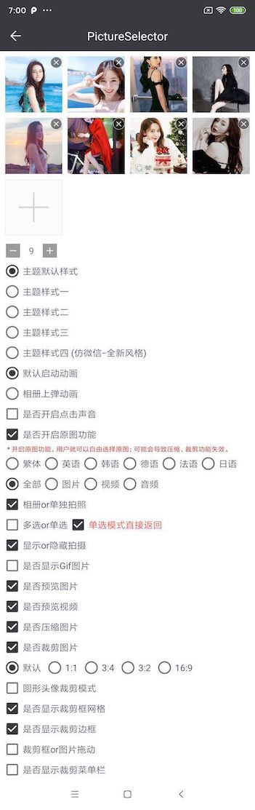|| 

| 默认风格 | 预览 | 多图裁剪 |
|:-----------:|:--------:|:---------:|
|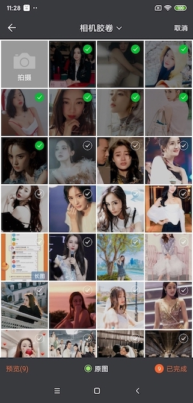 |  | 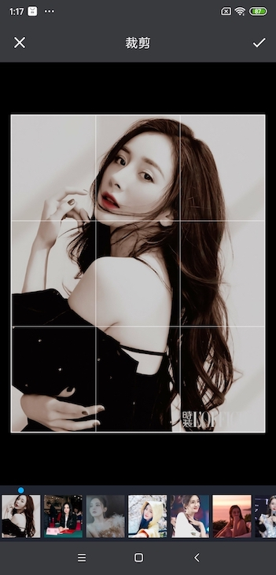|  

| 数字风格 | 预览 | 多图裁剪 |
|:-----------:|:--------:|:---------:|
|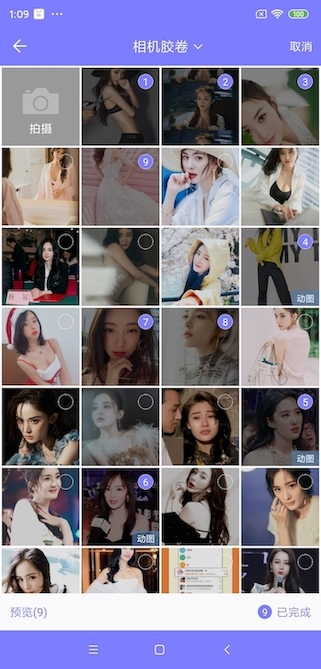 |  | 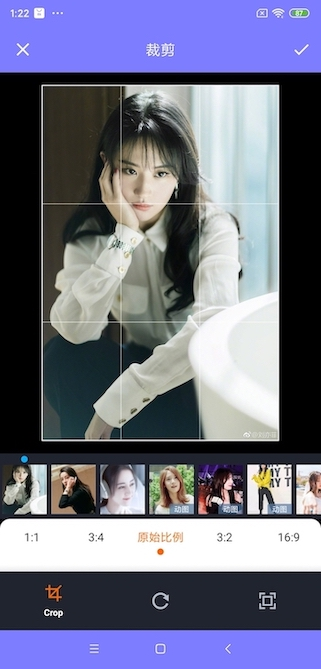| 

| 白色风格 | 预览 | 单图裁剪 |
|:-----------:|:--------:|:---------:|
|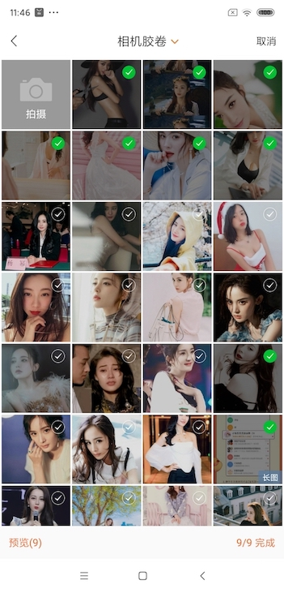 |  | | 

| 全新风格 | 预览 | 多图裁剪 |
|:-----------:|:--------:|:---------:|
|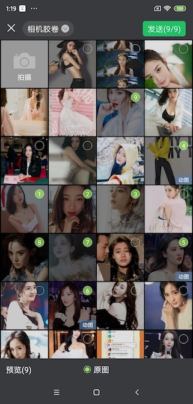 | 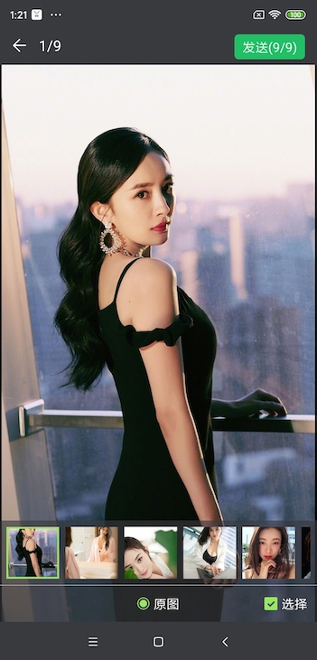 | 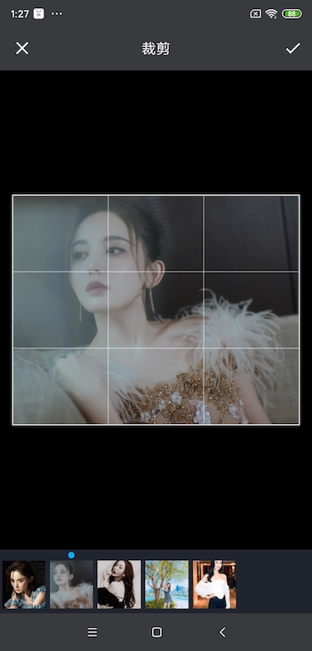| 

| 相册目录 | 单选模式 | 头像裁剪|
|:-----------:|:--------:|:--------:|
|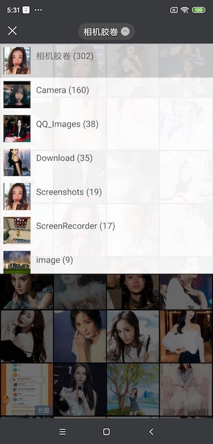 |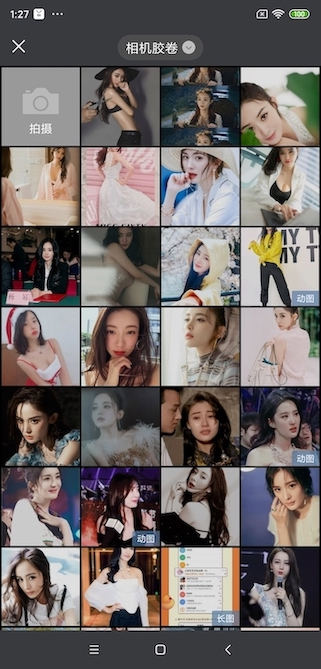 | 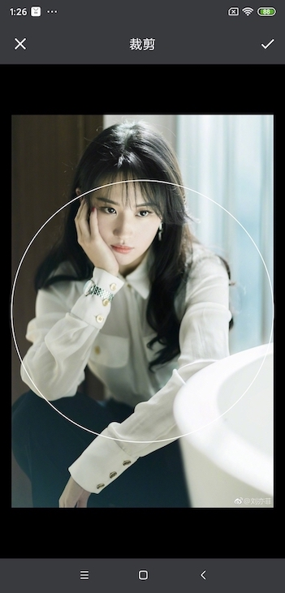| 

| 白色风格 | 视频 | 音频 |
|:-----------:|:-----------:|:--------:|
|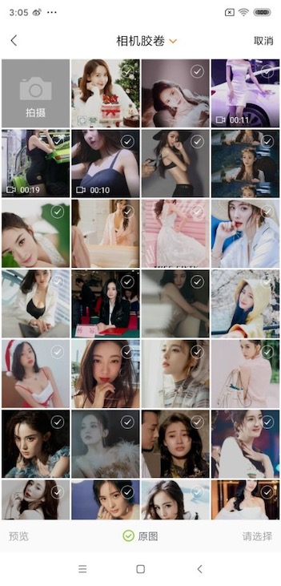 | | 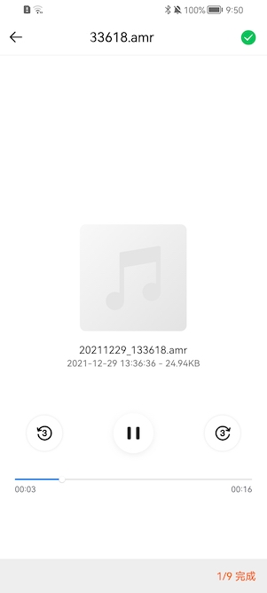| 

