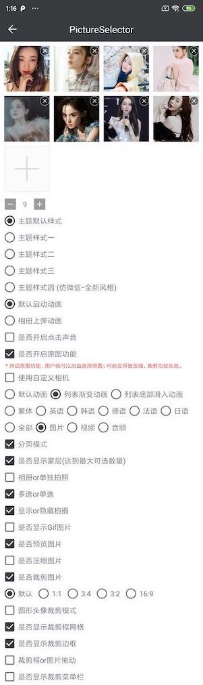
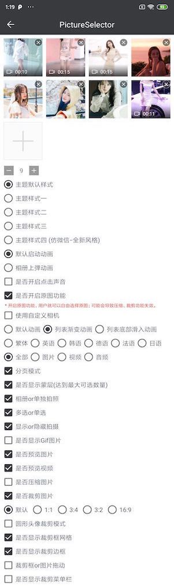

# PictureSelector 3.0
   一款针对Android平台下的图片选择器，支持从相册获取图片、视频、音频&拍照，支持裁剪(单图or多图裁剪)、压缩、主题自定义配置等功能，支持动态获取权限&适配Android 5.0+系统的开源图片选择框架。<br>
   
   [英文版🇺🇸](README.md)

   [效果体验](https://github.com/LuckSiege/PictureSelector/raw/master/app/demo/demo_2021-11-14_122603_v2.7.3-rc10.apk)<br>
  
[](https://jitpack.io/#LuckSiege/PictureSelector)
[](https://github.com/LuckSiege)
[](http://blog.csdn.net/luck_mw)
[](https://github.com/LuckSiege/PictureSelector/issues)
[](https://github.com/LuckSiege/PictureSelector)

## 目录
-[如何引用](#如何引用)<br>
-[进阶使用](#进阶使用)<br>
-[演示效果](#演示效果)<br>
-[混淆配制](#混淆配制)<br>
-[License](#License)<br>
-[常见错误](https://github.com/LuckSiege/PictureSelector/wiki/PictureSelector-3.0-%E5%B8%B8%E8%A7%81%E9%94%99%E8%AF%AF)<br>
-[如何提Issues](#如何提Issues)<br>
-[兼容性测试](#兼容性测试)<br>
-[联系方式](#联系方式)<br>


## 如何引用

使用Gradle
```sh
repositories {
  google()
  mavenCentral()
}

dependencies {
  // PictureSelector 基础library (必须)
  implementation 'io.github.lucksiege:pictureselector:v3.0.1'

  // 图片压缩 library (按需引入)
  implementation 'io.github.lucksiege:compress:v3.0.1'

  // 图片裁剪 library (按需引入)
  implementation 'io.github.lucksiege:ucrop:v3.0.1'

  // 自定义相机 library (按需引入)
  implementation 'io.github.lucksiege:camerax:v3.0.1'
}
```

或者Maven:

```sh
<dependency>
  <groupId>io.github.lucksiege</groupId>
  <artifactId>pictureselector</artifactId>
  <version>v3.0.1</version>
</dependency>

<dependency>
  <groupId>io.github.lucksiege</groupId>
  <artifactId>compress</artifactId>
  <version>v3.0.1</version>
</dependency>

<dependency>
  <groupId>io.github.lucksiege</groupId>
  <artifactId>ucrop</artifactId>
  <version>v3.0.1</version>
</dependency>

<dependency>
  <groupId>io.github.lucksiege</groupId>
  <artifactId>camerax</artifactId>
  <version>v3.0.1</version>
</dependency>
```

## 进阶使用
想要了解更多功能，请参阅[文档](https://github.com/LuckSiege/PictureSelector/wiki/PictureSelector-Api%E8%AF%B4%E6%98%8E)

简单用例如下所示:

1、获取图片
```sh
PictureSelector.create(this)
   .openGallery(SelectMimeType.ofImage())
   .setImageEngine(GlideEngine.createGlideEngine())
   .forResult(new OnResultCallbackListener<LocalMedia>() {
      @Override
      public void onResult(List<LocalMedia> result) {

      }

      @Override
      public void onCancel() {

     }
});
```

2、单独拍照
```sh
PictureSelector.create(this)
     .openCamera(SelectMimeType.ofImage())
     .forResult(new OnResultCallbackListener<LocalMedia>() {
        @Override
        public void onResult(List<LocalMedia> result) {

        }

        @Override
        public void onCancel() {

      }
});
```

设置图片选择器主题，更多请参阅[文档](https://github.com/LuckSiege/PictureSelector/wiki/PictureSelector-Api%E8%AF%B4%E6%98%8E)

```sh
.setSelectorUIStyle();
```
或者您可以重载布局，更多请参阅[文档](https://github.com/LuckSiege/PictureSelector/wiki/PictureSelector-Api%E8%AF%B4%E6%98%8E)

```sh
.setInjectLayoutResourceListener(new OnInjectLayoutResourceListener() {
   @Override
   public int getLayoutResourceId(Context context, int resourceSource) {
	return 0;
   }
```

高级用例如下所示：

1、使用自定义相机功能，详情请参阅[文档](https://github.com/LuckSiege/PictureSelector/wiki/PictureSelector-Api%E8%AF%B4%E6%98%8E)

```sh
.setCameraInterceptListener(new OnCameraInterceptListener() {
    @Override
    public void openCamera(Fragment fragment,PictureSelectionConfig config, int cameraMode, int requestCode){
	                                    
    }
});
```

2、使用图片压缩功能，详情请参阅[文档](https://github.com/LuckSiege/PictureSelector/wiki/PictureSelector-Api%E8%AF%B4%E6%98%8E)

```sh
.setCompressEngine(new CompressEngine() {
   @Override
   public void onStartCompress(Context context, ArrayList<LocalMedia> list, OnCallbackListener<ArrayList<LocalMedia>> call){
                                    
   }
});
```

3、使用图片裁剪功能，详情请参阅[文档](https://github.com/LuckSiege/PictureSelector/wiki/PictureSelector-Api%E8%AF%B4%E6%98%8E)

```sh

.setCropEngine(new CropEngine() {
   @Override
   public void onStartCrop(Fragment fragment, LocalMedia currentLocalMedia, ArrayList<LocalMedia> dataSource, int requestCode) {
                                    
   }
});
```


## 混淆配置 
```sh
-keep class com.luck.picture.lib.** { *; }
-keep class com.luck.lib.camerax.** { *; }
	
// 如果引入了Ucrop库请添加混淆
-dontwarn com.yalantis.ucrop**
-keep class com.yalantis.ucrop** { *; }
-keep interface com.yalantis.ucrop** { *; }
```
## License
```sh
Copyright 2016 Luck

Licensed under the Apache License, Version 2.0 (the "License");
you may not use this file except in compliance with the License.
You may obtain a copy of the License at

http://www.apache.org/licenses/LICENSE-2.0

Unless required by applicable law or agreed to in writing, software
distributed under the License is distributed on an "AS IS" BASIS,
WITHOUT WARRANTIES OR CONDITIONS OF ANY KIND, either express or implied.
See the License for the specific language governing permissions and
limitations under the License.
```

## 联系方式
Android开发交流 新群 [662320389]() <br>
Android开发交流 群一 [619458861]() (已满) <br>
Android开发交流 群二 [679824206]() (已满) <br>
Android开发交流 群三 [854136996]() (已满) <br>
QQ [893855882]() <br>


## 兼容性测试
******腾讯优测-深度测试-通过率达到100%******


## 演示效果

| 单一模式 | 混选模式 |
|:-----------:|:-----------:|
||| 

| 默认风格 | 预览 | 多图裁剪 |
|:-----------:|:--------:|:---------:|
| |  | |

| 数字风格 | 预览 | 多图裁剪 |
|:-----------:|:--------:|:---------:|
| |  | |

| 白色风格 | 预览 | 单图裁剪 |
|:-----------:|:--------:|:---------:|
| |  | |

| 全新风格 | 预览 | 多图裁剪 |
|:-----------:|:--------:|:---------:|
| |  | |

| 相册目录 | 单选模式 | 头像裁剪|
|:-----------:|:--------:|:--------:|
| | | |

| 白色风格 | 视频 | 音频 |
|:-----------:|:-----------:|:--------:|
| | | |

